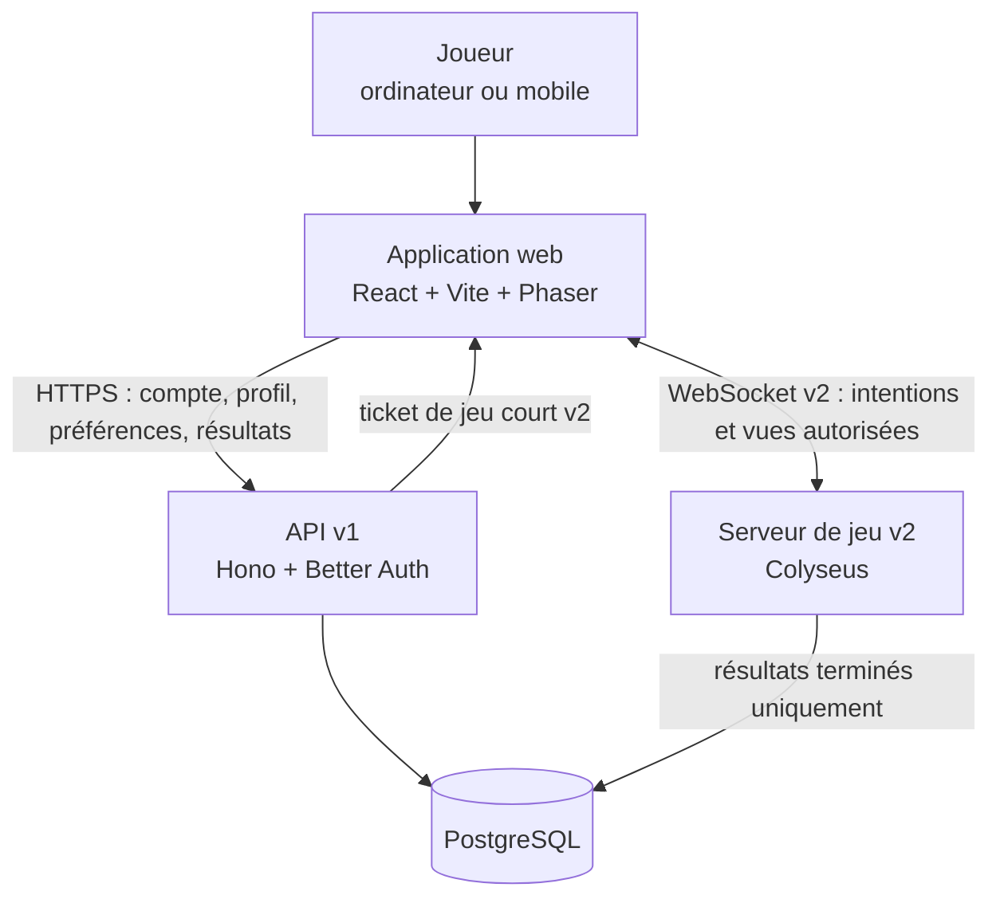
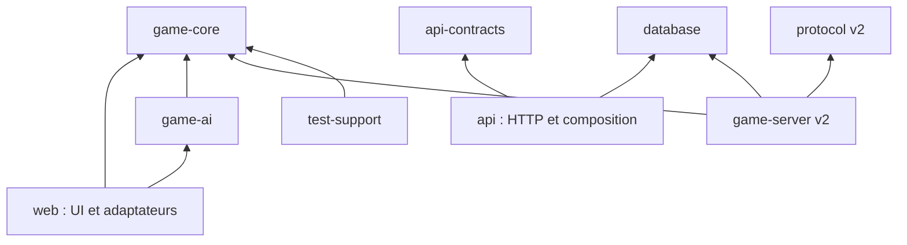
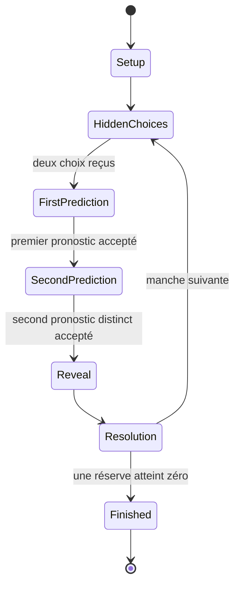
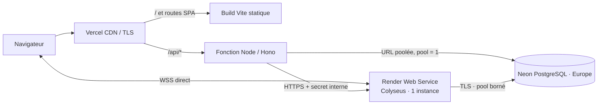

# Architecture technique

## Statut du document

Ce document décrit l'architecture cible de ThreeStone jusqu'à la v2
finale. Il constitue la référence technique avec :

- [`../README.md`](../README.md) pour la vision produit, les règles et la
  roadmap ;
- [`../AGENTS.md`](../AGENTS.md) pour les règles de travail ;
- [`pipeline-complete.md`](./pipeline-complete.md) pour l'ordre de réalisation
  et les portes qualité.

La candidate v2 est **implémentée et vérifiée localement**. Le moteur, l’IA, le
client solo, le compte par pseudonyme, l’API, PostgreSQL, le protocole privé et
le serveur Colyseus respectent les frontières décrites ici. Aucun déploiement
v2 n’est autorisé avant validation explicite. Une décision structurante qui
diverge de ce document doit être expliquée dans un ADR sous `docs/decisions/`,
puis répercutée ici.

## Périmètre architectural

### v1

- Application web React/Vite.
- Plateau et animations 2D/2.5D avec Phaser.
- Moteur de jeu déterministe partagé.
- Partie solo contre une IA.
- Compte utilisateur, session et cycle de vie du compte.
- Profil, préférences, résultats solo terminés et statistiques.
- API Hono sur Node.js.
- PostgreSQL et migrations versionnées avec Drizzle.

### v1.x

- Améliorations mesurées de l'IA, de l'accessibilité, du rendu et du
  chargement.
- Éventuel mode local à deux joueurs après validation de son ergonomie.

### v2

- Salons privés en ligne.
- Serveur de jeu Colyseus autoritaire.
- Protection des choix cachés.
- Reconnexion, resynchronisation, abandon et délais de tour.
- Persistance idempotente des résultats multijoueurs.

Le matchmaking public, le classement compétitif, les amis, les achats et les
services sociaux restent hors périmètre.

## Décisions v1 fermées

Les choix d’inscription par pseudonyme et mot de passe, de suppression, de
rétention et de topologie ont été validés dans `docs/decisions/`. La v1 utilise
des pseudonymes uniques sans distinction de casse et un cookie de session
Better Auth. Elle ne collecte pas d’email et n’a pas de récupération de mot de
passe oublié. Les décisions propres au protocole, aux tickets de salle et à
l’exploitation Colyseus sont verrouillées par `SPEC_V2.md` et l’ADR
d’hébergement v2.

## Facteurs architecturaux

L'architecture est guidée par les propriétés suivantes :

- **Justice** : l'IA ne voit aucun secret adverse et le serveur v2 arbitre les
  parties en ligne.
- **Déterminisme** : horloge et hasard sont injectés ; une graine et un
  historique identiques reproduisent la même partie.
- **Confidentialité** : état interne, état public et observation privée sont
  séparés.
- **Testabilité** : le domaine ne dépend ni du navigateur, ni du réseau, ni de
  la base.
- **Accessibilité** : les contrôles essentiels restent dans le DOM.
- **Évolutivité maîtrisée** : une instance temps réel suffit à la v2 initiale ;
  Redis reste exclu tant qu’une mesure ne justifie pas le multi-instance.
- **Portabilité** : TypeScript est partagé, sans rendre le domaine dépendant des
  frameworks.
- **Traçabilité** : règles, schémas, migrations et protocoles sont versionnés.

## Direction visuelle du client

La marque officielle est **ThreeStone**. Le logo `docs/logo.png` fixe le langage
graphique : fantasy stylisée nordique/médiévale, volumes massifs et facettés,
aspect sculpté ou peint à la main, lumière chaude de taverne.

Les tokens globaux du client traduisent cette direction :

- charbon brun pour le fond, sans dominante bleue ou verte ;
- cuir et bois pour les structures, menus et actions secondaires ;
- parchemin et blanc cassé pour les zones de lecture ;
- gris pierre chaud pour le plateau, les cartes et les éléments de jeu ;
- ambre, bronze et laiton pour les actions principales, le focus et les
  séparateurs ;
- vert mousse et rouge terre cuite uniquement pour les états sémantiques.

Les CSS Modules consomment ces tokens depuis `styles/globals.css`. Phaser
reprend les mêmes familles de couleurs dans le Canvas et utilise des polygones
facettés pour suggérer le low-poly. Le logo source ne rentre pas directement
dans le bundle : une variante optimisée sous le budget de 350 Ko est conservée
avec sa provenance dans `apps/web/src/assets/`.

L’accueil s’appuie sur le visuel optimisé `threestone-home-hands.webp`. Son
contenu fonctionnel reste limité à deux actions principales : lancer une partie
ou consulter les règles. Le lanceur React orchestre les étapes `mode`,
`difficulté` et `chargement` avant de monter l’écran solo. Le choix
multijoueur ouvre la création ou la jonction d’un salon privé, puis connecte le
navigateur au serveur autoritaire avec un ticket court. Les préférences
secondaires disposent d’un écran séparé accessible depuis l’en-tête.

## Vue d'ensemble



Le client web peut exécuter une partie solo sans aller-retour réseau. Le compte,
les préférences synchronisées et les résultats nécessitent l'API. En v2, le
serveur Colyseus exécute le même moteur de règles et devient l'unique autorité de
la partie en ligne.

## Conteneurs et responsabilités

| Conteneur | Version | Responsabilités | Ne doit pas faire |
| --- | --- | --- | --- |
| Application web | v1 + v2 | Écrans, accessibilité, saisies, plateau, orchestration solo, clients HTTP et WebSocket | Décider des règles, faire confiance à une réponse non validée, stocker une session dans `localStorage` |
| API | v1 | Authentification, profil, préférences, résultats, autorisation, validation HTTP | Piloter les phases du jeu solo, contenir du SQL dans les handlers |
| PostgreSQL | v1 | Identités, sessions, profils, préférences, résultats terminés, migrations | Servir d'état temps réel d'une salle |
| Serveur Colyseus | v2 | Salons, sièges, moteur autoritaire, secrets, délais, reconnexion | Faire confiance à l'état d'un client, exposer un choix caché |
| Redis éventuel | v2+ | Présence et coordination multi-instance | Être ajouté avant une décision de déploiement ou une mesure de charge |

## Organisation du dépôt

Cette structure reflète les frontières logiques. Les petits modules restent
proches de leur application pour éviter les abstractions vides.

```text
apps/
  web/
    src/
      app/                    Composition et navigation
      adapters/http/          Client API validé
      features/
        account/
        settings/
        solo-game/
      game/                   Projection et plateau Phaser Canvas
      styles/
    tests/                    Parcours Playwright
  api/
    src/
      application/            Services de profil, résultats et export
      auth/                   Better Auth et port de session
      config/                 Validation de l'environnement
      domain/                 Erreurs et ports de repositories
      http/                   Limitation de débit
      repositories/
  game-server/
    src/                      Salle, admission, délais, reprise et drainage
packages/
  game-core/
    src/                      Modèle, transitions, vues et replay
  game-ai/
    src/                      Stratégie, aléatoire, calibration et simulation
  api-contracts/
    src/                      Contrats profil, préférences, résultats et santé
  database/
    src/
      schema/
      client/
    migrations/
  protocol/
    src/                      Commandes, tickets et projections filtrées
  test-support/
    src/                      Générateurs et scénarios déterministes
docs/
  ARCHITECTURE.md
  pipeline-complete.md
  decisions/
  rules/
```

La structure exacte peut évoluer. Les frontières et le sens des dépendances
sont obligatoires, contrairement au nom précis des dossiers.

## Règle de dépendance



Contraintes :

- `game-core` n'importe aucun autre package du projet.
- `game-ai` dépend du domaine et reçoit une observation filtrée.
- `api-contracts` contient des schémas et DTO, pas de règle métier.
- `database` est serveur uniquement et ne doit jamais entrer dans le bundle web.
- `web` ne dépend pas de Drizzle, Better Auth serveur ou Colyseus serveur.
- `game-server` dépend du protocole ; le protocole ne dépend pas de Colyseus.
- Aucun framework ne devient un type public du moteur de jeu.

## Domaine du jeu

### Agrégat principal

`Game` est l'agrégat qui garantit les règles d'une partie complète. Il contient
conceptuellement :

- identifiant de partie ;
- version des règles ;
- mode `solo` ou `online` ;
- phase courante ;
- numéro de manche ;
- joueur ayant l'initiative ;
- état de chaque joueur et réserve restante ;
- choix cachés de la manche ;
- pronostics annoncés ;
- historique minimal d'événements ;
- gagnant éventuel ;
- version logique ou numéro de séquence.

Les noms ci-dessus décrivent le modèle, pas une obligation de forme du code.

### Machine à états



Une action incompatible avec la phase courante est refusée sans mutation.
`Reveal` et `Resolution` peuvent être deux événements successifs produits par
une même transition interne, mais l'interface doit pouvoir les présenter
distinctement.

### Règles invariantes

- Chaque réserve est comprise entre `0` et `3`.
- Un choix caché est compris entre `0` et la réserve du joueur.
- Un pronostic est un entier compris entre `0` et `6`.
- Les deux pronostics d'une manche sont distincts.
- Les cailloux cachés reviennent dans la réserve après révélation.
- Une bonne prédiction retire exactement un caillou.
- Au maximum un joueur gagne une manche.
- Une partie finie n'accepte plus d'action.
- L'initiative de la première manche alterne entre les parties.
- Le premier joueur à annoncer alterne à chaque manche.

### Actions conceptuelles

- Créer une partie.
- Enregistrer un choix caché.
- Annoncer un pronostic.
- Révéler et résoudre la manche.
- Commencer la manche suivante.
- Abandonner une partie en ligne.
- Expirer un délai en ligne.

Les actions utilisateur ne déclenchent pas directement une animation. Elles
passent par le moteur, qui émet ensuite des événements confirmés.

### Événements conceptuels

- Partie créée.
- Choix reçu, sans valeur publique avant révélation.
- Pronostic annoncé.
- Mains révélées.
- Manche gagnée ou sans gagnant.
- Réserve diminuée.
- Initiative transférée.
- Partie gagnée.
- Joueur déconnecté, reconnecté, expiré ou ayant abandonné en v2.

Les événements publics ne contiennent jamais un secret avant `Mains révélées`.

## État interne, vues et secrets

Trois représentations sont nécessaires :

1. **État interne** : contient tous les choix et n'existe que dans le moteur
   local solo ou sur le serveur v2.
2. **Vue publique** : phase, réserves, pronostics déjà annoncés, état de
   connexion et événements révélés.
3. **Observation privée** : vue publique enrichie du propre choix du joueur et
   des actions qu'il est autorisé à soumettre.

L'IA reçoit exactement une observation privée. En v2, chaque client reçoit une
projection correspondant à son siège. Les logs, métriques et traces utilisent
uniquement des données publiques ou des identifiants techniques non sensibles.

## Déterminisme et temps

- Le générateur pseudo-aléatoire est injecté.
- Une graine est fixée lors de la création de la partie.
- L'IA ne lit pas directement `Math.random`.
- Le moteur ne lit pas l'heure système.
- Les délais v2 sont convertis par le serveur en actions de domaine explicites.
- Les animations utilisent leur propre horloge et n'affectent pas le résultat.
- Un replay est reconstruit depuis la version des règles, la graine et les
  actions ou événements nécessaires.

## Architecture du client web

### React

React gère :

- navigation interne et shell applicatif ;
- écrans d’inscription et connexion par pseudonyme, changement de pseudonyme ou
  de mot de passe et suppression ;
- profil en deux vues, bannière, avatar, bio, statistiques, historique et
  réglages de confidentialité repliables ;
- tutoriel, menus, dialogues et annonces accessibles ;
- sélection tactile des cailloux, avec zéro représenté par une sélection vide ;
- pronostic par curseur `0..6`, avec exclusion de la valeur déjà annoncée ;
- profils de table, réserves restantes, initiative et bulles de pronostic ;
- orientation multijoueur canonique : `player-one` à gauche et `player-two` à
  droite pour que profil, main, score et victoire restent cohérents entre les
  deux navigateurs ;
- état de session et appels API ;
- orchestration du mode solo.

L'état React ne duplique pas le modèle complet du domaine. Il conserve une vue
de présentation et délègue les transitions au contrôleur de partie.
Lorsqu’une action résout une manche, `game-presentation.ts` déroule une séquence
locale testée — premier pronostic, deux pronostics, révélation, résolution —
sans retarder ni réinterpréter la transition métier déjà validée.

### Phaser

Phaser gère :

- plateau neutre en pierre chaude et poses de mains fermées/ouvertes ;
- cailloux révélés, somme et caillou jeté, tous dessinés dynamiquement ;
- respiration des mains fermées, ouverture avec déplacement et fondu, apparition
  des cailloux puis trajectoire en arc du caillou retiré.

La v1 force le renderer Canvas : ce plateau 2D n'a pas besoin de WebGL et ce
choix évite des différences de pilotes entre Chromium, Firefox et WebKit.
Aucun son ni musique n’est livré dans la candidate v2. Phaser reçoit uniquement
un modèle de présentation dérivé d’événements confirmés et ne décide jamais du
résultat d’une manche.
Les visuels de mains ne contiennent ni texte, ni profil, ni caillou précalculé :
ces éléments varient avec l’état confirmé. La préférence de réduction des
mouvements remplace la séquence par ses états finaux courts.

### Contrôleur de partie

Le contrôleur :

- traduit les intentions de l'UI en actions ;
- produit une vue stable pour React et Phaser ;
- fait jouer l'IA jusqu'à rendre la main à l'humain ou terminer la partie ;
- refuse une action illégale via le moteur partagé.

Le contrôleur multijoueur traduit les commandes, séquences et snapshots validés
du package `protocol` sans réutiliser l’état local solo comme autorité.
Les échéances publiques sont calculées par le serveur : le client en dérive un
compte à rebours purement indicatif. Après une partie, la première commande
« Rejouer » ouvre une fenêtre de réponse ; l’adversaire accepte ou refuse
explicitement, puis le snapshot expose cette décision sans ambiguïté.

### Stockage navigateur

`localStorage` peut conserver uniquement :

- réduction des mouvements ;
- préférences d'affichage avant connexion ;
- état du tutoriel.

Il ne contient jamais :

- jeton ou cookie de session ;
- mot de passe ;
- choix caché ;
- ticket de salle v2 ;
- état considéré comme officiel ;
- donnée personnelle non nécessaire.

Les préférences du compte sont synchronisées en base. Une stratégie de fusion
explicite détermine si les valeurs locales sont importées à la première
connexion.

## Architecture de l'API v1

Le flux d'une route applicative est :

**route Hono → authentification → schéma d'entrée → service → repository →
Drizzle/PostgreSQL → DTO de sortie**

### Couche HTTP

- Monte les routes Better Auth sous un préfixe dédié.
- Résout la session.
- Valide paramètres, query et body.
- Appelle un seul cas d'usage principal.
- Mappe résultat ou erreur de domaine vers HTTP.
- Sérialise un DTO public validé.
- Ajoute identifiant de corrélation, en-têtes de sécurité et limites.

Elle ne contient ni logique métier, ni requête Drizzle.

### Services applicatifs

Cas d'usage implémentés :

- lire et modifier son profil ;
- enregistrer et supprimer son avatar ; le propriétaire le lit dans son profil
  et les joueurs authentifiés le voient comme identité de jeu ;
- lire et modifier ses préférences ;
- enregistrer un résultat solo terminé ;
- consulter son historique et ses statistiques ;
- orchestrer la suppression des données applicatives lors de la suppression du
  compte ;
- exporter les données du compte ;
- créer ou rejoindre un salon privé et renouveler un ticket court ;
- consulter son historique multijoueur privé.

Chaque service effectue l'autorisation sur l'identité résolue et dépend
d'interfaces de repositories.

### Repositories

- Encapsulent Drizzle et les transactions.
- Ne contiennent pas de règle de jeu.
- N'acceptent pas un identifiant utilisateur fourni par le client lorsque
  l'identité doit venir de la session.
- Mappent lignes et modèles applicatifs.
- Rendent l'enregistrement d'un résultat idempotent.

## Authentification

L'authentification utilise Better Auth avec PostgreSQL et son adaptateur
Drizzle.

### Session web v1

- Cookie de session `httpOnly`.
- Attribut `secure` en production.
- Politique `sameSite` privilégiant un déploiement sous le même site.
- Origines de confiance explicites.
- Protection CSRF et CORS cohérente avec le mode de cookie.
- Rotation, expiration et révocation prises en charge par la bibliothèque.
- Limitation de débit sur inscription, connexion, changement de mot de passe et
  suppression.

L'API et le client devraient être exposés sous le même domaine lorsque possible,
par exemple `/` pour le client et `/api` pour l'API.

### Identité du serveur de jeu v2

Le cookie web n'est pas copié dans un stockage JavaScript persistant. Le flux
implémenté est :

1. Le client authentifié demande à l'API un ticket de jeu.
2. L'API vérifie la session et émet un jeton court, signé et limité à une salle
   ou à une opération de création de salle.
3. Le client garde ce ticket uniquement en mémoire.
4. Colyseus vérifie signature HMAC, expiration, identifiant à usage unique,
   génération de connexion et autorisation de salle.
5. Le ticket est consommé ou expire rapidement.

Le ticket n’est jamais placé dans l’URL. La reprise utilise un jeton rotatif,
à usage unique, émis directement par le serveur de jeu.

## Contrats HTTP

Les groupes fonctionnels v1 exposés sont :

| Groupe | Exemples d'opérations | Authentification |
| --- | --- | --- |
| Auth | inscription et connexion par pseudonyme, session, déconnexion, changement de mot de passe | Selon l’opération |
| Profil | lire et modifier la bio ; enregistrer, lire ou supprimer l’avatar | Requise |
| Préférences | lire et modifier mouvement et affichage | Requise |
| Résultats solo | enregistrer un résultat terminé et lister son historique | Requise |
| Statistiques | lire ses agrégats solo et multijoueurs | Requise |
| Compte | exporter ou supprimer ses données selon la décision produit | Requise et renforcée |
| Multijoueur | créer/rejoindre un salon, renouveler un ticket et lire son historique | Requise |

Règles de contrat :

- versionner les ruptures, pas chaque ajout compatible ;
- limiter taille et cardinalité ;
- pagination déterministe pour les listes ;
- dates UTC en format explicite ;
- identifiants opaques ;
- erreurs génériques côté client, détails corrélés côté serveur ;
- aucune ligne de base ou modèle Better Auth exposé directement.

## Modèle de données

### Tables appartenant à Better Auth

Le nom exact dépendra du schéma généré :

- utilisateur ;
- session ;
- compte d'authentification ;
- vérification, conservée par compatibilité mais sans parcours public en v1 ;
- clés nécessaires aux plugins retenus.

Ces tables ne sont pas modifiées manuellement sans suivre la procédure de
migration de Better Auth. La table utilisateur porte `username` normalisé,
`display_username` et les colonnes cœur `email`/`email_verified`. Ces deux
dernières sont des détails internes : l’adresse technique sous
`players.invalid` est filtrée à la frontière HTTP et des exports.

### Tables applicatives

| Modèle | Rôle | Contraintes principales |
| --- | --- | --- |
| `player_profile` | Présentation du joueur, bio et avatar v1 | Un profil par utilisateur ; bio ≤ 280 caractères ; avatar JPEG/PNG/WebP ≤ 1 Mio ; version optimiste |
| `player_preferences` | Audio, mouvement, affichage et tutoriel | Un enregistrement par utilisateur ; valeurs bornées |
| `game_record` | Résultat terminal d'une partie solo ou en ligne | Identifiant stable unique ; mode, version de règles, dates, état terminal |
| `game_participant` | Siège, adversaire, résultat et variation de réserve | Unicité partie + siège ; utilisateur nullable pour l'IA |
| `multiplayer_game` | Résultat terminal autoritaire | `game_id` unique ; versions, graine, initiative et motif terminal |
| `multiplayer_participant` | Deux sièges d’une partie en ligne et trace des Stones | Unicité partie + siège ; utilisateur nullable après suppression ; Stones avant, variation et après |
| `multiplayer_round` | Transcript révélé des manches | Unicité partie + numéro ; choix, pronostics, somme et réserves cohérents |
| `active_multiplayer_lease` | Bail expirant d’un compte actif | Un bail par compte ; jeton de propriétaire, heartbeat et expiration |
| `player_stones` | Projection courante de la cote de duel | Un enregistrement par joueur coté ; valeur entière, initialisée à zéro ; nombre de duels cotés |

Le total « Parties jouées » additionne les résultats solo et multijoueurs.
Les Stones forment une projection transactionnelle séparée, car leur calcul
dépend de la valeur courante des deux adversaires. Les anciennes statistiques solo restent
calculables mais ne sont plus présentées dans le profil.

La v2 conserve uniquement le transcript métier révélé des manches terminées.
Elle ne persiste ni journal réseau, ni commande refusée, ni temps de réflexion,
ni secret technique.

### Source de vérité

- Better Auth est source de vérité pour identité et session.
- `player_profile` est source de vérité pour la bio et l’avatar du joueur ; le
  pseudonyme de connexion reste la responsabilité de Better Auth.
- `game_record` et `game_participant` sont source de vérité pour les résultats
  terminés.
- `multiplayer_game`, ses participants et ses manches sont la preuve
  autoritaire des duels ; `player_stones` est leur projection cotée courante.
- les statistiques calculées sont une vue reconstructible depuis les résultats,
  jamais une preuve indépendante.
- L'état mémoire Colyseus est source de vérité d'une partie en ligne active.
- Le client est source d'une intention, jamais d'un résultat compétitif.

### Résultats solo non fiables

Le moteur solo tourne dans le navigateur. Un utilisateur peut donc falsifier un
appel API ou modifier son client. Le serveur valide la forme, la cohérence
élémentaire, l'identité et l'idempotence d'un résultat solo, mais ne peut pas
prouver que la partie a été jouée honnêtement.

Conséquences :

- statistiques solo clairement séparées des résultats autoritaires en ligne ;
- aucune récompense compétitive fondée uniquement sur un résultat solo ;
- pas de mécanisme anti-triche complexe en v1 ;
- toute compétition future devra être arbitrée côté serveur.

## Transactions et idempotence

- Une migration et une écriture métier sont deux préoccupations distinctes.
- Résultat, participants, transcript et projection de Stones sont écrits dans
  une même transaction.
- `gameId` est unique.
- Répéter l'enregistrement du même résultat renvoie le résultat existant ou un
  succès équivalent.
- Un même identifiant avec un contenu contradictoire est refusé et journalisé
  sans exposer le contenu sensible.
- En v2, seul le serveur de salle peut finaliser le résultat autoritaire.
- Les retries réseau n'entraînent ni double victoire ni double incrément.

## Migrations et cycle de données

Chaque changement de schéma inclut :

1. schéma Drizzle modifié ;
2. migration SQL versionnée ;
3. test sur base vierge ;
4. test depuis la version de production précédente ;
5. analyse de compatibilité avec l'ancienne application pendant le déploiement ;
6. sauvegarde et procédure de retour arrière ;
7. mise à jour de ce document si le modèle logique change.

Les migrations destructrices utilisent une stratégie expand/migrate/contract :
ajouter la nouvelle forme, migrer les données, déployer les lecteurs, puis
retirer l'ancienne forme dans une livraison ultérieure.

La suppression de compte doit définir :

- suppression ou anonymisation des résultats ;
- conservation légale ou opérationnelle éventuelle ;
- invalidation immédiate des sessions ;
- traitement des salles actives en v2 ;
- preuve technique sans conserver de donnée personnelle inutile.

## Architecture de l'IA

L'IA expose une décision à partir de :

- l'observation privée de son siège ;
- la liste des actions légales ;
- son profil de difficulté ;
- un générateur pseudo-aléatoire injecté ;
- un historique public autorisé.

Elle ne reçoit pas l'état interne complet. Les stratégies envisagées sont :

- distribution des sommes possibles ;
- mémoire limitée des choix et bluffs observés ;
- pondération des pronostics légaux ;
- bruit contrôlé pour les difficultés inférieures.

L'équilibrage s'appuie sur un simulateur hors UI. Les résultats de simulation
doivent être reproductibles et comparables entre versions.

## Serveur multijoueur v2

Le contrat détaillé et son ordre d'implémentation sont définis dans
[`SPEC_V2.md`](./SPEC_V2.md) et [`PIPELINE_V2.md`](./PIPELINE_V2.md). Ces
documents prévalent sur les formulations v2 historiques de cette architecture
tant que leur alignement est en cours.

### Salle

Une salle Colyseus possède :

- deux sièges maximum ;
- une version de règles ;
- un moteur `game-core` ;
- les choix privés associés aux sessions ;
- une vue publique synchronisée ;
- des délais gérés par le serveur ;
- un numéro de séquence ;
- un statut de connexion par joueur ;
- un identifiant de résultat persistant.

### Protocole

Les clients envoient uniquement des commandes :

- rejoindre ou confirmer un siège ;
- soumettre un choix caché ;
- annoncer un pronostic ;
- demander une resynchronisation ;
- abandonner.

Le serveur envoie :

- snapshot autorisé ;
- accusé d'acceptation ou refus générique ;
- événement public ;
- information privée destinée à un seul siège ;
- état de connexion et délai ;
- résultat terminal.

Chaque message est validé avec le package `protocol`. Il porte une version, un
type discriminant et, lorsque nécessaire, un identifiant de commande. Les
commandes répétées sont idempotentes ou explicitement refusées.

### Reconnexion

- Une session de siège survit pendant une fenêtre limitée.
- Le joueur reconnecté est réauthentifié.
- Le serveur envoie un snapshot filtré, puis les événements plus récents si
  nécessaire.
- Un ancien client ne peut pas reprendre un siège avec un ticket expiré.
- Tant qu’aucun adversaire n’a rejoint, une suspension mobile du créateur ne
  consomme pas la grâce de partie : son invitation reste valide 15 minutes.
- À l’arrivée du second siège, la grâce de 60 secondes démarre pour tout
  créateur encore absent ; la partie attend deux connexions et deux états
  `ready` avant d’armer les délais de gameplay. Chaque synchronisation réseau
  authentifiée positionne le siège correspondant à `ready`, indépendamment du
  cycle de rendu de l’interface.
- Si la connexion initiale échoue avant tout jeton de reprise, le client
  renouvelle son ticket court via l’API ; les reprises suivantes utilisent le
  jeton rotatif directement auprès du game-server.
- À expiration du délai, une action de domaine décide abandon ou défaite selon
  la règle produit.
- Le résultat d'une reconnexion ne dépend pas d'une animation locale.

### Persistance

L'état actif reste en mémoire de la salle. PostgreSQL reçoit seulement :

- le résultat terminal validé ;
- les deux participants et leurs sièges ;
- le motif terminal : victoire, abandon, délai ou déconnexion ;
- la version des règles et du protocole, la graine et l'initiative initiale ;
- le transcript métier révélé, avec choix, pronostics, somme, gagnant et
  réserves de chaque manche.

Le transcript n'est pas un journal réseau : il ne contient ni commande refusée,
ni ticket, ni jeton, ni temps de réflexion, ni choix avant sa révélation
normale. La partie, les participants et les manches sont écrits dans une
transaction idempotente. Seuls les deux participants peuvent lire ce
récapitulatif. La suppression d'un compte conserve l'intégrité du résultat mais
remplace son identité par « Joueur supprimé » pour l'autre participant.

## Sécurité

### Menaces principales

- vol ou fixation de session ;
- credential stuffing et brute force ;
- CSRF, CORS trop permissif et XSS ;
- accès au profil ou résultat d'un autre utilisateur ;
- falsification de résultat solo ;
- réutilisation d'un ticket de salle ;
- message réseau malformé, trop gros ou répété ;
- lecture prématurée d'un choix caché ;
- double soumission ou concurrence de deux onglets ;
- fuite dans logs, métriques ou erreurs ;
- dépendance ou asset compromis.

### Contrôles

- HTTPS uniquement en production.
- Cookies sécurisés et sessions révocables.
- Origines autorisées explicites.
- Validation de toutes les frontières avec limites de taille.
- Autorisation par identité résolue côté serveur.
- Limitation de débit par route, identité et adresse lorsque pertinent.
- Réponses d'authentification ne facilitant pas l'énumération de comptes.
- En-têtes CSP, HSTS, `nosniff`, politique de référent et anti-framing.
- Secrets injectés par l'environnement et jamais livrés au client.
- Dépendances verrouillées et auditées.
- Tickets v2 courts, limités et non persistés dans le navigateur.
- Projection privée par siège et tests explicites de non-divulgation.
- Journalisation structurée avec redaction.

## Résilience et erreurs

### Client

- Distinguer chargement, absence de données, erreur récupérable et session
  expirée.
- Permettre de rejouer un appel idempotent.
- Ne jamais perdre une partie solo à cause d'une animation.
- Si l'enregistrement du résultat échoue, conserver une tentative minimale non
  sensible et la rejouer après reconnexion seulement si la stratégie produit le
  permet.

### API

- Timeouts explicites pour la base et les appels réseau.
- Erreurs de domaine mappées vers des statuts stables.
- Identifiant de corrélation dans chaque erreur.
- Readiness distincte de la liveness.
- Arrêt gracieux et fermeture du pool PostgreSQL.

### Serveur de jeu

- Refus d'une commande invalide sans mutation.
- Protection contre double envoi.
- Arrêt gracieux des nouvelles admissions.
- Politique documentée pour les salles actives lors d'un déploiement.
- Persistance du résultat retentable et idempotente.

### Comportement v2 face aux pannes

| Incident | Partie active | Admission et reprise | Résultat persistant |
| --- | --- | --- | --- |
| Coupure réseau d'un joueur | Le délai de son action continue. La grâce est de 60 s, dans un budget cumulé de 120 s. | Reprise directe auprès du game-server avec un jeton en mémoire, rotatif et à usage unique. | Défaite seulement si le délai d'action ou la grâce expire ; aucune pénalité pour une reprise à temps. |
| API Hono indisponible | Les salons déjà ouverts continuent. | Aucune nouvelle admission ; une reprise transitoire reste possible sans l'API. | Aucun résultat artificiel. |
| PostgreSQL momentanément indisponible | Le salon continue jusqu'à la dernière expiration de bail prouvée. | Les admissions dépendantes de la base échouent proprement. | Le résultat est retentable ; une perte définitive du bail annule sans gagnant. |
| Crash du game-server | L'état en mémoire est perdu et la partie ne peut pas continuer. | Le bail orphelin expire au plus tard après 120 s. | Aucun faux gagnant ni fausse défaite n'est écrit. |
| Arrêt technique maîtrisé ou perte définitive du bail | Le salon est annulé et cesse d'accepter des commandes. | Les jetons de reprise deviennent inutilisables. | Annulation technique sans gagnant. |

Une commande reçue après son échéance est refusée même si le rappel du minuteur
a été retardé par la boucle d'événements : le serveur vérifie toujours l'horloge
avant d'appliquer la commande.

## Observabilité

### Logs

Champs attendus :

- niveau ;
- horodatage UTC ;
- service et version ;
- environnement ;
- identifiant de corrélation ;
- route ou type de message ;
- code d'erreur stable ;
- durée ;
- identifiant pseudonymisé de partie si nécessaire.

Sont interdits : mot de passe, cookie, jeton, choix caché avant révélation, corps
complet de requête et donnée personnelle non nécessaire.

### Métriques

v1 :

- latence et taux d'erreur API ;
- succès et échec des parcours d'authentification sans adresse email ;
- saturation du pool PostgreSQL ;
- temps de chargement et erreurs client agrégées si une télémétrie est
  explicitement autorisée ;
- taux de réussite et durée moyenne des parties pour calibrer l'IA, avec
  minimisation des données.

v2 :

- connexions actives et salons créés, rejoints, terminés ou annulés ;
- reprises réussies et refusées, abandons et expirations ;
- nombre de commandes mesurées et latence d’acceptation p95 ;
- échecs de renouvellement de bail ;
- échecs de persistance terminale.

Toute télémétrie produit nécessite une décision de consentement et de rétention.

## Performance

- Définir un budget d'assets avant la production graphique.
- Charger d'abord le shell et les contrôles, puis le plateau.
- Utiliser atlas, formats modernes et niveaux de qualité adaptés.
- Maintenir une interaction fluide sur les appareils cibles, mesurée et non
  supposée.
- Ne pas rerendre React à chaque frame Phaser.
- Garder le moteur synchrone et rapide ; les entrées-sorties restent hors
  domaine.
- Paginer les historiques.
- Indexer les recherches par utilisateur, date et identifiant de partie après
  examen des requêtes réelles.
- Effectuer des tests de charge avant d'ajouter cache ou Redis.

## Accessibilité

- Tous les choix de jeu possèdent un contrôle HTML utilisable au clavier.
- Le focus est visible et restauré après dialogue.
- Les changements de phase importants sont annoncés par une région live sans
  bruit excessif.
- Le canvas possède une alternative textuelle représentant l'état utile.
- Couleur, mouvement et son ne sont jamais les seuls canaux.
- Les animations respectent la réduction des mouvements.
- Le zoom texte et les tailles d'écran ciblées ne masquent aucune action.
- Les erreurs d'authentification sont associées aux champs sans révéler
  d'information sensible.

## Environnements et déploiement

### Local

- Client et API lancés ensemble avec `pnpm dev`.
- PostgreSQL 17 lancé par `docker compose up -d`, avec données de développement
  non sensibles.
- Seeds réservés aux données fictives.
- Configuration locale copiée depuis `.env.example`, sans secret committé.

### Test et intégration continue

- PostgreSQL isolé comme service CI.
- Migrations appliquées depuis zéro avant les suites.
- Parcours d’authentification testés sans dépendance réseau externe.
- Horloge et hasard contrôlés.
- Navigateurs Playwright gérés par la CI.

### Staging

- Topologie proche de la production.
- Base et secrets distincts.
- Tests de migration, restauration, sécurité et smoke tests.
- Salons v2 séparés de la production.

### Production

Topologie cible v2, préparée mais non déployée :



Le projet Vercel racine produit `apps/web/dist` et une fonction unique
`api/index.mjs`. Une réécriture conserve le chemin `/api/*` attendu par Hono.
L'API reste stateless hors sessions persistées. Les migrations sont une
opération de release explicite utilisant l'URL Neon non poolée ; elles ne
s'exécutent jamais pendant le démarrage d'une fonction. Les secrets de
production et de preview restent distincts.

Le game-server accepte le `PORT` fourni par Render, expose liveness, readiness,
métriques internes et drainage, et exige une origine web HTTPS exacte. Une seule
instance Colyseus est suffisante au lancement v2 selon la charge mesurée. Redis
et le routage multi-instance ne sont ajoutés qu'avec une stratégie explicite de
présence et d'affinité des salles.

Le runbook exécutable est
[`OPERATIONS_V2.md`](./OPERATIONS_V2.md). Le dossier de preuves et le point de
validation préalable aux actions distantes sont dans
[`VALIDATION_V2.md`](./VALIDATION_V2.md).

## Stratégie de tests

| Niveau | Cible | Outils recommandés |
| --- | --- | --- |
| Unitaire | Moteur, IA, services et mappers | Vitest |
| Propriétés | Invariants et séquences d'actions déterministes | Générateurs de `test-support` |
| Intégration | API, Better Auth, repositories et migrations | Vitest + PostgreSQL isolé |
| Contrat | DTO HTTP et messages v2 | Zod + tests de compatibilité |
| Composant | React, contrôleur et adaptateur Phaser | Outils React + fakes déterministes |
| Navigateur | Compte, profil personnalisé, réglages repliables, solo et accessibilité | Playwright |
| Multijoueur | Deux clients, secrets, reconnexion et délais | Playwright + serveur réel de test |
| Charge | API, connexions et salles | Outil choisi par ADR |
| Sécurité | Authz, validation, fuites et dépendances | Tests dédiés + revue |

Les tests du moteur précèdent la présentation. Les tests de non-divulgation
précèdent la synchronisation v2. Les migrations sont testées sur une base vierge
et depuis la version précédente.

## ADR

Les ADR v1 acceptés sont indexés dans
[`decisions/README.md`](./decisions/README.md), dont la stack et le renderer,
le cycle de compte par pseudonyme, PostgreSQL/Drizzle, la séparation
public/privé, la rétention, la topologie de déploiement, les budgets visuels et
le stockage de l’avatar v1.
L’ADR
[`ADR-0006`](./decisions/ADR-0006-hebergement-game-server-v2.md) fixe
l’hébergement Render, l’instance unique, WSS, les secrets, le drainage et le
retour arrière. `SPEC_V2.md` fixe le protocole, les tickets, la reprise et le
transcript terminal.

## Évolution contrôlée

Une proposition d'évolution doit répondre à cinq questions :

1. Quelle exigence ou mesure la justifie ?
2. Quelle frontière change ?
3. Quel nouveau risque de sécurité ou de cohérence apparaît ?
4. Comment migrer données, clients ou protocole ?
5. Comment revenir en arrière ?

La séquence v2, ses dépendances et ses portes sont détaillées dans
[`PIPELINE_V2.md`](./PIPELINE_V2.md). La pipeline historique jusqu’à la v1
reste dans [`pipeline-complete.md`](./pipeline-complete.md).
