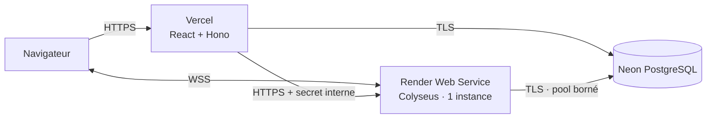

# Exploitation et livraison de la v2

## Statut

Ce runbook prépare la livraison du multijoueur privé de ThreeStone. Il ne vaut
pas autorisation de déploiement.

La candidate est validée localement. Aucun push, service Render, environnement
Vercel ou changement de base distante ne doit être effectué avant une
validation explicite du propriétaire du projet.

## Topologie retenue



- Vercel sert le build Vite et l’API Hono.
- Render exécute un unique processus Node long vivant pour Colyseus.
- Neon conserve comptes, sessions, profils, baux et résultats terminaux.
- Redis, équilibrage multi-instance et reprise d’une salle sur une autre
  instance restent hors périmètre.
- Le game-server accepte `PORT`, fourni par l’hébergeur, ou
  `GAME_SERVER_PORT` en local.

## Prérequis d’une release

Une release ne commence que si :

1. le propriétaire a explicitement autorisé le push et le déploiement ;
2. la branche candidate et le commit à livrer sont identifiés ;
3. `pnpm validate:v2` est vert sur ce commit avec PostgreSQL disponible ;
4. l’audit ne contient aucune vulnérabilité élevée ou critique non acceptée ;
5. une sauvegarde ou un point de restauration Neon existe ;
6. les secrets staging et production sont distincts ;
7. le client, l’API et le game-server utilisent le protocole `2.0` ;
8. la version précédente et sa procédure de retour arrière sont disponibles.

`pnpm validate:v2` exécute qualité, build, tests, audit de dépendances, tests
PostgreSQL, charge multijoueur et parcours Playwright. Cette commande ne migre
et ne déploie rien.

## Configuration

### Valeurs publiques

| Variable | Vercel | Render | Règle |
| --- | --- | --- | --- |
| `WEB_ORIGIN` | oui | oui | URL HTTPS exacte du web, sans joker |
| `GAME_SERVER_PUBLIC_URL` | oui | non | URL WSS publique du game-server |
| `VITE_GAME_SERVER_URL` | build web | non | même URL WSS, injectée avant le build |
| `VITE_API_URL` | build web | non | origine HTTPS de l’API |
| `BETTER_AUTH_URL` | oui | non | origine HTTPS publique de l’API |
| `GAME_SERVER_INTERNAL_URL` | oui | non | URL HTTPS du game-server, sans chemin |
| `GAME_SERVER_HOST` | non | optionnel | `0.0.0.0` |
| `PORT` | non | fourni | port d’écoute Render |
| `GAME_SERVER_INSTANCE_ID` | non | oui | identifiant stable de l’instance |
| `NODE_ENV` | oui | oui | `production` |

### Secrets

| Variable | Vercel | Render | Partage |
| --- | --- | --- | --- |
| `DATABASE_URL` | oui | oui | même base, accès TLS et pools bornés |
| `DATABASE_URL_UNPOOLED` | release seulement | non | migration explicite |
| `BETTER_AUTH_SECRET` | oui | non | Vercel uniquement |
| `MULTIPLAYER_TICKET_SECRET` | oui | oui | identique entre API et game-server |
| `GAME_SERVER_INTERNAL_SECRET` | oui | oui | identique entre API et game-server |

Les trois secrets applicatifs sont aléatoires, distincts et longs d’au moins
32 caractères. Ils ne figurent ni dans Git, ni dans une variable `VITE_*`, ni
dans une URL, ni dans les logs.

`DATABASE_MAX_CONNECTIONS` reste borné. Avec une seule instance initiale,
commencer bas et augmenter uniquement après mesure de la saturation.

## Commandes de service

Configuration recommandée pour le Web Service Render :

```text
Build : corepack enable && pnpm install --frozen-lockfile && pnpm build
Start : pnpm --filter @three-stone/game-server start
Health check : /health/ready
Instance : une seule, toujours active, région européenne
```

Le démarrage échoue volontairement si un secret manque, si `WEB_ORIGIN`
n’utilise pas HTTPS en production ou si une valeur est hors limites.

## Migration de la base

Le schéma v2 est livré par trois migrations ordonnées :

- `0004_strange_morgan_stark.sql` ajoute les baux et tables multijoueurs ;
- `0005_daffy_stryfe.sql` ajoute la progression compétitive initiale ;
- `0006_secret_diamondback.sql` la renomme en **Stones** et fixe son origine à
  zéro.

Elles conservent les tables et données v1.

Procédure :

1. fermer les nouvelles admissions sur la version déjà en service ;
2. créer un point de restauration Neon ;
3. vérifier que l’URL utilisée est l’URL non poolée du bon environnement ;
4. appliquer `pnpm db:migrate` depuis le commit candidat ;
5. vérifier la présence des tables et index v2 ;
6. démarrer la nouvelle instance ;
7. exécuter les smoke tests avant de rendre le parcours visible.

Ne jamais lancer une migration automatiquement au démarrage d’une fonction
Vercel ou du game-server.

### Compatibilité de retour arrière

La migration `0004` est additive et une version v1 ignore ses tables. Les
migrations `0005` et `0006` font évoluer uniquement le modèle v2 ; après leur
application, le rollback doit donc cibler un commit qui connaît le champ
`stones`, pas une révision intermédiaire qui attend encore `renown`. Aucune
suppression de tables ne fait partie d’un rollback d’urgence.

## Séquence de livraison

### Staging

1. créer des secrets, URLs et une base propres au staging ;
2. migrer la base staging ;
3. déployer une seule instance Colyseus ;
4. vérifier liveness, readiness et origine WSS ;
5. déployer le web/API avec les URLs staging ;
6. jouer avec deux comptes : partie normale, délai, abandon et reprise pendant
   une indisponibilité simulée de l’API ;
7. vérifier la demande **Rejouer** acceptée puis refusée, son compte à rebours,
   le score `2 – 1`, l’avatar et l’historique ;
8. exécuter la charge de 20 salons / 40 connexions ;
9. tester une fois le drainage et le rollback ;
10. consigner les preuves et obtenir la validation de production.

### Production

1. annoncer et démarrer le drainage de l’ancienne instance ;
2. attendre que `activeRooms` atteigne zéro, au plus dix minutes ;
3. laisser le serveur annuler sans gagnant les salons encore ouverts à
   l’échéance ;
4. vérifier que l’état est `drained` ;
5. créer le point de restauration puis appliquer la migration ;
6. déployer le game-server ;
7. vérifier `/health/live` puis `/health/ready` ;
8. déployer l’API et le web compatibles ;
9. exécuter les smoke tests techniques puis une partie à deux comptes ;
10. surveiller admissions, reprises, baux, délais et persistances.

Une nouvelle instance démarre en mode admission ouverte. Un contrôleur déjà
drainé ne doit pas être « réouvert » : il est remplacé par le nouveau processus.

## Contrôles de santé

| Service | Endpoint | Succès | Échec utile |
| --- | --- | --- | --- |
| API | `/api/health/live` | processus joignable | plateforme ou fonction indisponible |
| API | `/api/health/ready` | PostgreSQL joignable | ne pas ouvrir les parcours persistants |
| Game-server | `/health/live` | processus joignable | redémarrer ou revenir en arrière |
| Game-server | `/health/ready` | DB joignable et admissions ouvertes | 503 pendant drainage ou panne DB |

La liveness ne doit pas dépendre de PostgreSQL. La readiness doit devenir 503
dès que le drainage commence.

## Contrôles internes

Les endpoints suivants exigent l’en-tête `x-game-server-secret` :

| Méthode et chemin | Usage |
| --- | --- |
| `GET /internal/v1/metrics` | métriques bornées du processus |
| `GET /internal/v1/drain` | état du drainage et nombre de salles |
| `POST /internal/v1/drain` | fermeture des admissions et délai de dix minutes |

Ils ne doivent jamais être appelés depuis le navigateur. Les réponses ne
contiennent ni pseudo, ni identifiant de compte, ni code de salon, ni ticket,
ni jeton de reprise, ni choix caché.

## Smoke tests après livraison

### Technique

- web : statut 200, CSP présente, aucun secret dans les assets ;
- API liveness : 200 ;
- API readiness : 200 ;
- game-server liveness : 200 ;
- game-server readiness : 200 ;
- une origine WebSocket différente est refusée ;
- les endpoints internes répondent 401 sans le secret.

### Fonctionnel à deux comptes

1. créer un salon et rejoindre avec le code ;
2. confirmer que les deux navigateurs placent chaque joueur, sa main et son
   score du même côté ;
3. soumettre deux choix cachés et vérifier l’absence de progression adverse ;
4. terminer une manche et vérifier la même révélation des deux côtés ;
5. couper le réseau du joueur qui doit agir et vérifier que son délai continue ;
6. reprendre directement auprès du game-server ;
7. terminer une partie et vérifier gagnant, transcript et historique ;
8. accepter une demande **Rejouer** et vérifier l’alternance de l’initiative ;
9. abandonner une autre partie et vérifier le score de session ;
10. contrôler clavier, mobile et mouvement réduit.

## Métriques et seuils initiaux

Le snapshot interne expose :

- connexions actives ;
- salons créés, rejoints, terminés et annulés ;
- reprises réussies et refusées ;
- abandons et délais ;
- nombre de commandes mesurées et latence p95 ;
- échecs de renouvellement de bail ;
- erreurs de persistance terminale.

Déclencher une investigation si :

- la readiness reste à 503 hors drainage ;
- la latence p95 dépasse 500 ms sous la charge cible ;
- les erreurs de persistance ou de bail augmentent ;
- les reprises échouées augmentent brutalement ;
- une instance redémarre pendant des salons actifs.

Les métriques en mémoire repartent à zéro au redémarrage. Toute collecte externe
doit préserver les mêmes dimensions bornées et la minimisation des données.

## Drainage

Le drainage est idempotent :

1. le premier appel ferme immédiatement créations et jonctions ;
2. les parties actives disposent de dix minutes ;
3. une salle terminée se désinscrit du contrôleur ;
4. à l’échéance, les salles restantes sont annulées avec
   `server-draining` ;
5. aucun gagnant ni résultat terminal artificiel n’est persisté.

Un `SIGTERM` ferme aussi les admissions et déclenche l’arrêt gracieux. Il ne
remplace pas le drainage préalable, car la fenêtre accordée par la plateforme
peut être plus courte que dix minutes.

## Retour arrière

1. fermer les admissions de la version fautive ;
2. attendre ou annuler les salles selon la procédure de drainage ;
3. conserver les migrations `0004` à `0006` et choisir un commit compatible
   avec le champ `stones` ;
4. redéployer le dernier commit compatible avec le protocole `2.0` ;
5. rétablir ensemble les URLs publiques et internes ;
6. exécuter les quatre contrôles de santé ;
7. jouer une partie courte avec deux comptes ;
8. maintenir les admissions fermées si les écritures terminales ou les baux
   restent en erreur.

Ne jamais restaurer une base par-dessus des résultats écrits après le point de
restauration sans décision explicite sur la perte de données.

## Incidents connus

| Incident | Réponse |
| --- | --- |
| API indisponible | Les salons existants et la reprise directe continuent ; aucune nouvelle admission. |
| PostgreSQL indisponible | Readiness à 503, admissions refusées ; les écritures terminales sont retentées en mémoire avec backoff. |
| Crash game-server | Les salles en mémoire sont perdues sans faux gagnant ; les baux expirent en 120 s. |
| Secret de ticket compromis | Drainer, faire tourner le secret simultanément sur API et game-server, puis redéployer les deux. |
| Secret interne compromis | Drainer, renouveler le secret des deux services et vérifier les appels aux endpoints internes. |
| Client incompatible | Refuser explicitement le protocole plutôt que tenter une conversion implicite. |

## Limites publiées

- Une seule instance : un redémarrage perd les salles actives.
- Aucun journal durable des commandes en cours ni replay public.
- La file de nouvelle tentative d’un résultat est en mémoire ; une panne DB
  combinée au crash du processus peut perdre ce résultat.
- Les métriques sont locales au processus.
- Les avatars constituent une identité de jeu visible aux joueurs authentifiés ;
  la bio, le compte et l’historique restent privés.
- Aucun son ni musique n’est livré.
- Le déploiement et le test dynamique public restent à exécuter après
  validation.
