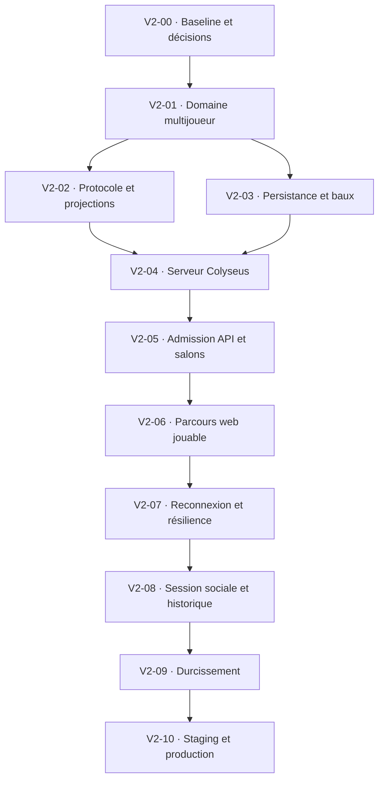

# Pipeline de développement — ThreeStone v2 multijoueur

- Statut : exécutée localement jusqu’à la porte de déploiement
- Version du document : `1.1.0`
- Cible : première v2 multijoueur privée exploitable
- Méthode : TDD, incréments verticaux et serveur autoritaire
- Date : 2026-07-30

## 1. Rôle de ce document

Cette pipeline transforme [`SPEC_V2.md`](./SPEC_V2.md) en une séquence de
livraison concrète. Elle décrit l’ordre des lots, leurs dépendances, les tests à
écrire avant le code et les preuves exigées pour avancer.

Elle est la référence d’exécution pour la v2. La pipeline générale
[`pipeline-complete.md`](./pipeline-complete.md) reste l’historique des phases
précédentes ; en cas de divergence sur le multijoueur, ce fichier prévaut.

La pipeline ne redéfinit pas les règles. Les sources normatives restent :

- [`SPEC_V2.md`](./SPEC_V2.md) pour le comportement multijoueur ;
- [`rules/game-rules-v1.md`](./rules/game-rules-v1.md) pour les règles ;
- [`ARCHITECTURE.md`](./ARCHITECTURE.md) pour les frontières ;
- [`../AGENTS.md`](../AGENTS.md) pour les standards de développement.

## 2. Périmètre verrouillé

La livraison couvre :

- deux joueurs authentifiés dans un salon privé ;
- serveur Colyseus autoritaire sur une instance ;
- choix cachés protégés, pronostics, révélation et victoire ;
- délais, abandon, déconnexion et reprise directe ;
- bail PostgreSQL expirant par compte ;
- résultat, transcript et transfert de Stones persistés sans doublon ;
- demande de rejouer explicite et score de session ;
- historique privé, accessibilité et charge initiale proportionnée.

Elle n’inclut pas matchmaking public, classement public, amis, chat libre, vocal,
spectateurs, replay public, achats, Redis ou multi-instance.

L’option B de la spécification est l’hypothèse active : un joueur ne voit
jamais si l’adversaire a déjà soumis son choix caché.

## 3. Principes d’exécution

### 3.1 Boucle obligatoire de chaque comportement

1. **RED** — écrire le plus petit test observable et vérifier qu’il échoue pour
   la raison attendue ;
2. **GREEN** — implémenter le minimum pour le faire passer ;
3. **REFACTOR** — simplifier sans modifier le comportement ;
4. **PROVE** — exécuter la suite du lot puis les contrôles de non-régression ;
5. **DOCUMENT** — mettre à jour contrat, migration ou runbook concerné ;
6. **COMMIT** — produire un commit compréhensible limité au lot.

Un test écrit après l’implémentation n’est pas une preuve RED. La trace de la
première exécution en échec doit apparaître dans le compte rendu du lot.

### 3.2 Règles de progression

- Un seul lot est `EN COURS`.
- Un lot ne commence que lorsque ses dépendances sont `VALIDÉES`.
- Une porte ne passe pas avec un test ignoré, rendu moins strict ou remplacé
  par un mock qui évite le comportement important.
- Les changements v1 non liés restent intacts.
- Toute modification de règle, d’équité, de sécurité ou de protocole public
  met le lot en pause jusqu’à mise à jour de la spécification.
- Les tests rapides s’exécutent pendant la boucle ; `pnpm check` clôt le lot.
- Les tests PostgreSQL, navigateur et charge sont exécutés aux portes qui les
  demandent, pas à chaque micro-changement.

### 3.3 Définition commune de terminé

Un lot est `VALIDÉ` lorsque :

- ses critères d’acceptation sont démontrés ;
- ses tests RED sont devenus verts ;
- formatage, lint, types, build et tests concernés passent ;
- aucun secret ou donnée cachée n’est ajouté aux logs ;
- la documentation touchée correspond au code ;
- le diff ne contient aucun changement hors périmètre ;
- un commit atomique et lisible clôt le lot.

## 4. Vue d’ensemble



| Lot | Résultat principal | Dépend de | État actuel |
| --- | --- | --- | --- |
| V2-00 | Contrats et baseline figés | — | Validé |
| V2-01 | Domaine multijoueur pur | V2-00 | Validé |
| V2-02 | Protocole public/privé versionné | V2-01 | Validé |
| V2-03 | Schéma, transcript et bail | V2-01 | Validé |
| V2-04 | Salle Colyseus autoritaire | V2-02, V2-03 | Validé |
| V2-05 | Création et admission sécurisées | V2-04 | Validé |
| V2-06 | Partie à deux navigateurs | V2-05 | Validé |
| V2-07 | Reprise et pannes maîtrisées | V2-06 | Validé |
| V2-08 | Rejouer, score et historique | V2-07 | Validé |
| V2-09 | Sécurité, accessibilité et charge | V2-08 | Validé |
| V2-10 | Déploiement v2 vérifié | V2-09 | Prêt localement — validation requise |

Les preuves consolidées figurent dans
[`VALIDATION_V2.md`](./VALIDATION_V2.md). La procédure de staging, production,
drainage et retour arrière est décrite dans
[`OPERATIONS_V2.md`](./OPERATIONS_V2.md). Aucun push ou déploiement n’a été
effectué.

## 5. V2-00 — Baseline et décisions

### Objectif

Commencer sur une v1 verte et supprimer toute ambiguïté qui modifierait une
API, une migration ou l’équité pendant l’implémentation.

### Travail

- valider l’option B : progression du choix caché privée ;
- créer l’unique ADR bloquant sur l’hébergement du processus Colyseus, TLS,
  domaines, secrets et retour arrière ;
- aligner README, architecture, AGENTS et exemples d’environnement sur
  `SPEC_V2.md` et cette pipeline ;
- fixer les versions Node, Colyseus et du protocole avant le scaffold ;
- inventorier les variables v2 sans leur attribuer de valeur secrète ;
- capturer la baseline v1 : tests, build, taille des bundles et parcours E2E.

### Porte V2-00

- aucune décision ouverte ne change l’équité, la sécurité ou le schéma ;
- l’option B est écrite comme décision active ;
- l’ADR de déploiement est accepté ;
- `pnpm check`, tests d’intégration et E2E v1 passent ;
- aucun package v2 n’a encore modifié le comportement solo.

Commit suggéré : `docs(v2): verrouille les décisions et la pipeline multijoueur`.

## 6. V2-01 — Domaine multijoueur et transcript

### Objectif

Étendre `packages/game-core` avec des transitions pures réutilisables par le
serveur, sans dépendance à Colyseus, PostgreSQL ou l’horloge système.

### RED

- démarrage à trois cailloux et alternance des annonçants ;
- choix caché légal, illégal ou reçu deux fois ;
- second pronostic différent du premier ;
- résolution, retrait d’un caillou et victoire ;
- expiration atomique avec zéro, un ou deux choix acceptés ;
- expiration d’un pronostic ;
- abandon et annulation technique distincts ;
- score de session inchangé après annulation ;
- transcript identique pour la même suite d’actions ;
- régression complète du mode solo.

### GREEN

- introduire les actions et événements de domaine nécessaires ;
- représenter séparément partie, session et motif terminal ;
- recevoir temps, graine et expirations par paramètres injectés ;
- produire un transcript à partir des événements révélés ;
- ne conserver aucune notion de socket, ticket ou repository dans le moteur.

### Porte V2-01

- toutes les transitions sont déterministes ;
- aucune lecture directe de l’heure ou de l’aléatoire global ;
- les cas `0/1/2 choix` sont verrouillés ;
- la graine seule n’est présentée nulle part comme replay humain ;
- les tests de `game-core`, `game-ai` et du web solo passent.

Commit suggéré : `feat(game-core): ajoute le domaine multijoueur déterministe`.

## 7. V2-02 — Protocole et projections confidentielles

### Objectif

Créer `packages/protocol` comme unique contrat d’exécution entre navigateur,
API et serveur de jeu.

### RED

- validation de chaque commande et réponse du protocole `2.0` ;
- rejet des champs inconnus, valeurs invalides et messages trop grands ;
- absence réelle du choix adverse avec `hasOwnProperty` ;
- absence de borne dérivée et d’indicateur de soumission adverse ;
- observation privée limitée au siège destinataire ;
- accusé de choix dont la forme ne dépend pas de la valeur ;
- incompatibilité de version et erreurs publiques finies ;
- sérialisation stable des snapshots par phase.

### GREEN

- créer les unions discriminées Zod et TypeScript ;
- définir enveloppe, `commandId`, `knownSequence` et erreurs stables ;
- séparer état interne, snapshot public et observations privées ;
- fournir des fabriques de projection pures ;
- exporter uniquement les contrats nécessaires aux consommateurs.

### Porte V2-02

- aucune structure interne n’est synchronisée automatiquement ;
- un test inspecte tous les messages adressés à l’adversaire ;
- l’option B est prouvée par contrat ;
- le package se construit sans dépendre de React, Colyseus ou Drizzle.

Commit suggéré : `feat(protocol): définit les contrats privés du multijoueur`.

## 8. V2-03 — Persistance terminale et bail expirant

### Objectif

Ajouter les données durables sans transformer PostgreSQL en moteur de salle.

### RED

- acquisition concurrente d’un bail par le même compte ;
- reconnexion autorisée vers le même salon ;
- autre salon refusé tant que le bail est valide ;
- renouvellement et libération conditionnels au bon jeton ;
- expiration après crash et impossibilité pour l’ancien propriétaire d’agir ;
- insertion atomique partie, participants et manches ;
- nouvelle tentative du même `gameId` sans doublon ni double statistique ;
- unicité `(game_id, round_number)` ;
- anonymisation après suppression d’un participant ;
- migration depuis le schéma v1 et création depuis une base vide.

### GREEN

- ajouter les tables de parties multijoueurs, participants, manches et baux ;
- créer les repositories derrière des interfaces applicatives ;
- utiliser une transaction pour le résultat et le transcript ;
- indexer les lectures réelles : participant, date et partie ;
- générer et tester la migration Drizzle versionnée.

### Porte V2-03

- le bail expire après 120 s et se renouvelle toutes les 30 s ;
- aucun choix de manche n’est écrit avant le résultat terminal ;
- aucune salle active complète n’est persistée ;
- les tests PostgreSQL réels passent depuis zéro et depuis la v1.

Commit suggéré : `feat(database): persiste les parties multijoueurs et leurs baux`.

## 9. V2-04 — Serveur Colyseus autoritaire

### Objectif

Créer `apps/game-server` et faire fonctionner une salle à deux clients de test,
sans interface finale.

### RED

- liveness, readiness et arrêt gracieux ;
- exactement deux sièges authentifiés ;
- commande du mauvais siège ou de la mauvaise phase refusée sans mutation ;
- séquence strictement croissante ;
- même `commandId` et même contenu sans double effet ;
- `commandId` réutilisé avec un contenu différent rejeté ;
- ancienne génération de connexion rejetée ;
- snapshot public et privé conformes au package protocole ;
- fin de partie persistée une seule fois.

### GREEN

- scaffolder l’application Node/Colyseus et ses scripts workspace ;
- injecter moteur, horloge, hasard, repositories et vérificateur de ticket ;
- garder secrets, commandes traitées et jetons de reprise hors de l’état public ;
- router les commandes vers `game-core` ;
- diffuser des snapshots filtrés après chaque mutation ;
- annuler sans gagnant au crash ou à la fermeture technique.

### Porte V2-04

- deux clients programmatiques terminent une partie ;
- le serveur est la seule source de vérité ;
- aucun faux gagnant n’est persisté après arrêt simulé ;
- build, types et tests du nouveau workspace passent.

Commit suggéré : `feat(game-server): ajoute la salle Colyseus autoritaire`.

## 10. V2-05 — Admission API et salons privés

### Objectif

Relier la session Better Auth au serveur de jeu sans exposer code, identité ou
ticket.

### RED

- création réservée à un compte authentifié sans bail incompatible ;
- codes inconnus, expirés, complets et inaccessibles indistinguables ;
- limitation de débit par compte et IP ;
- ticket valable 45 s, lié au compte, salon, siège et action ;
- ticket réutilisé ou altéré refusé ;
- ticket absent des URL, logs et réponses d’erreur ;
- échec du serveur de jeu libérant le bail provisoire ;
- troisième joueur refusé.

### GREEN

- ajouter les contrats HTTP de création, jonction et ticket ;
- créer un canal interne authentifié API → game-server pour réserver ou
  résoudre un salon ;
- faire générer l’identifiant de salon avant l’acquisition transactionnelle du
  bail ;
- signer le ticket initial avec le secret d’environnement partagé ;
- consommer son identifiant anti-rejeu dans l’instance de jeu ;
- ajouter les limites et erreurs génériques.

### Porte V2-05

- deux comptes obtiennent chacun un siège autorisé ;
- un compte ne peut occuper deux salons ;
- l’énumération de codes ne révèle aucune cause ;
- aucune valeur secrète ne figure dans une capture HTTP ou les logs de test.

Commit suggéré : `feat(api): sécurise la création et l’admission aux salons`.

## 11. V2-06 — Parcours web multijoueur jouable

### Objectif

Permettre à deux navigateurs de créer, rejoindre et terminer une partie normale.

### RED

- création et saisie accessible du code ;
- avatars, pseudos, présence et état prêt ;
- sièges, mains et score projetés dans la même orientation sur les deux
  navigateurs ;
- main victorieuse et couronne associées au même joueur depuis les deux points
  de vue ;
- choix caché local confirmé sans état de soumission adverse ;
- ordre des pronostics et valeur déjà annoncée interdite ;
- révélation identique sur les deux clients ;
- victoire et réserves convergentes ;
- commandes clavier, tactile et souris ;
- animation incapable de modifier ou bloquer l’état officiel.

### GREEN

- ajouter un adaptateur réseau séparé de React et Phaser ;
- garder le jeton de reprise uniquement en mémoire ;
- conserver le `commandId` pendant les nouvelles tentatives ;
- construire les écrans créer, rejoindre, salon et partie ;
- projeter les événements serveur vers les animations existantes ;
- resynchroniser l’interface depuis un snapshot sans rejouer les transitions.

### Porte V2-06

- un E2E avec deux contextes navigateur termine une partie ;
- les deux clients convergent après chaque manche ;
- aucune information adverse cachée n’apparaît dans le store ou le DOM ;
- solo, profil, paramètres et accueil restent fonctionnels.

Commit suggéré : `feat(web): livre le parcours multijoueur de bout en bout`.

## 12. V2-07 — Délais, reprise et résilience

### Objectif

Rendre la partie robuste aux pertes de réseau sans créer de stratégie de triche.

### RED

- délai du joueur actif continuant pendant sa propre déconnexion ;
- délai adverse inchangé par la coupure de l’autre siège ;
- grâce de 60 s et budget cumulé de 120 s ;
- action devenant due pendant l’absence et expirant normalement ;
- zéro choix à l’échéance annulant sans résultat ;
- un choix à l’échéance donnant une défaite ;
- jeton de reprise à usage unique, haché et rotatif ;
- reprise directe réussie lorsque l’API est indisponible ;
- code de salon utilisable 15 minutes malgré la suspension du navigateur du créateur ;
- grâce de reconnexion du créateur démarrant seulement à l’arrivée du second siège ;
- seconde admission n’activant aucune manche tant que le créateur est absent ;
- nouveau ticket API demandé si la connexion initiale échoue avant tout jeton de reprise ;
- nouvelle connexion invalidant l’ancienne génération ;
- snapshot après perte ou réordre de messages ;
- perte définitive du bail annulant le salon.

### GREEN

- ajouter les échéances monotones par siège ;
- évaluer atomiquement les choix reçus à l’échéance ;
- émettre et renouveler le jeton de reprise depuis le game-server ;
- implémenter le backoff client sans recharger la page ;
- conserver le siège d’un créateur seul pendant la durée d’invitation puis
  appliquer la grâce normale dès que l’adversaire rejoint ;
- remettre `ready` à faux lors d’une déconnexion antérieure au démarrage et
  afficher un salon à deux profils jusqu’au retour du joueur absent ;
- faire de la synchronisation réseau authentifiée la source du statut `ready`,
  sans dépendre d’un effet React exécuté en arrière-plan ;
- renouveler le ticket court lorsque la première socket n’a pas pu obtenir de
  jeton de reprise ;
- renouveler les baux et annuler proprement en cas de perte ;
- distinguer abandon explicite, délai, déconnexion et annulation technique.

### Porte V2-07

- couper le réseau avec trois secondes restantes ne donne que trois secondes ;
- la reprise transitoire ne dépend pas de Hono ;
- un code partagé reste joignable pendant 15 minutes et une socket mobile
  suspendue ne crée pas de manche fantôme ;
- aucun scénario de concurrence ne produit deux résultats ;
- arrêt brutal, panne API et panne DB ont un résultat documenté et testé.

Commit suggéré : `feat(multiplayer): sécurise les délais et la reconnexion`.

## 13. V2-08 — Session sociale minimale et historique

### Objectif

Rendre les parties successives agréables et consultables sans créer de réseau
social.

### RED

- victoire normale, abandon ou délai ajoutant un point de session ;
- annulation n’ajoutant aucun point ;
- demande de rejouer affichée chez l’adversaire avec acceptation ou refus sous 60 s ;
- premier annonçant initial alternant entre deux parties ;
- réaction hors liste ou trop fréquente refusée ;
- réaction éphémère, non persistée et masquable ;
- deux participants lisant le même transcript ;
- tiers interdit ;
- suppression de compte anonymisant l’identité partagée.

### GREEN

- ajouter score et demande de rejouer à l’état mémoire du salon ;
- conserver la validation des réactions du protocole 2 sans les exposer dans le client officiel ;
- persister le résultat, les manches et le transfert de Stones dans une
  transaction idempotente ;
- exposer l’historique et un récapitulatif par manche ;
- fusionner solo et multijoueur dans le Journal de jeu ;
- afficher le total de parties et les Stones définies par
  [`rules/stones-v2.md`](./rules/stones-v2.md), sans classement public.

### Porte V2-08

- une série `2 – 1` fonctionne dans le même salon ;
- aucun bouton de réaction n’est exposé dans la partie ;
- graine et transcript reproduisent le déroulé validé ;
- une répétition du même résultat ne modifie les Stones qu’une seule fois ;
- une victoire courte transfère plus de Stones qu’une victoire longue ;
- fermeture du salon efface score, état de rejeu, réactions de compatibilité et jetons.

Commit suggéré : `feat(multiplayer): ajoute rejouer score et historique`.

## 14. V2-09 — Durcissement proportionné

### Objectif

Prouver la sécurité, l’accessibilité et la capacité réellement nécessaires au
lancement.

### RED

- fuzz de messages malformés, trop grands, rapides ou réordonnés ;
- accès croisé entre salons, sièges et historiques ;
- recherche de ticket, code, jeton ou choix caché dans logs et télémétrie ;
- parcours clavier et lecteur d’écran ;
- mouvement réduit, zoom texte, mobile portrait et bureau ;
- 20 salons et 40 connexions simultanées ;
- déploiement demandé pendant des salons actifs.

### GREEN

- finaliser validation, limites de taille et de débit ;
- configurer origine WSS, CSP et redaction ;
- ajouter les métriques minimales de la spécification ;
- corriger les défauts d’accessibilité bloquants ;
- documenter l’annulation sans résultat et le drainage de dix minutes ;
- optimiser uniquement les goulots mesurés.

### Porte V2-09

- aucune fuite inter-salon ou de choix caché ;
- latence p95 d’acceptation inférieure à 500 ms sous la charge cible ;
- aucune commande perdue silencieusement ;
- aucun défaut d’accessibilité bloquant sur le parcours critique ;
- aucune vulnérabilité critique ou élevée non acceptée.

Commit suggéré : `chore(v2): durcit sécurité accessibilité et résilience`.

## 15. V2-10 — Staging, production et retour arrière

### Objectif

Préparer puis, après validation explicite, déployer une v2 vérifiable sans
promettre une infrastructure prématurée.

### Travail

- provisionner une instance Node longue durée pour Colyseus ;
- configurer WSS, domaines, origine autorisée et secrets distincts ;
- appliquer et vérifier les migrations sur staging ;
- ajouter liveness, readiness et smoke tests ;
- exécuter deux comptes : partie normale, délai, abandon et reprise sans API ;
- vérifier historique, score, demande pour rejouer et anonymisation ;
- exécuter le scénario de 20 salons ;
- tester une fois le drainage et le retour à la version précédente ;
- déployer en production puis ouvrir les créations de salons ;
- surveiller admissions, reprises, baux et persistences terminales.

La préparation locale, les contrôles automatisés et le runbook sont terminés.
Le provisionnement, les migrations distantes, le staging et la production
restent volontairement en attente de validation ; ils ne peuvent pas être
marqués comme exécutés sur la seule preuve locale.

### Porte terminale v2

- toutes les portes V2-00 à V2-09 sont validées ;
- `pnpm check`, intégration PostgreSQL et E2E multijoueur passent ;
- le serveur Colyseus n’est pas exécuté dans une fonction Vercel ;
- les variables secrètes sont absentes du dépôt et du bundle web ;
- un crash n’invente pas de gagnant et un bail orphelin expire ;
- les instructions de déploiement, drainage et retour arrière sont utilisables ;
- les limites connues sont publiées.

Commit suggéré : `release(v2): prépare le multijoueur privé pour la production`.

## 16. Matrice de preuves

| Invariant | Preuve principale | Lot |
| --- | --- | --- |
| Serveur seul autoritaire | Intégration à deux clients | V2-04 |
| Secret adverse structurellement absent | Contrat + inspection des messages | V2-02 |
| Aucun tell de soumission attribué | Snapshot et DOM | V2-02, V2-06 |
| Déconnexion sans gain de temps | Horloge contrôlée + E2E réseau | V2-07 |
| Double timeout déterministe | Tests `0/1/2 choix` | V2-01, V2-07 |
| Commande idempotente | Test concurrent `commandId` | V2-04 |
| Un compte, un salon | Test PostgreSQL concurrent | V2-03, V2-05 |
| Reprise sans API | Intégration game-server directe | V2-07 |
| Résultat écrit une fois | Transaction répétée | V2-03, V2-08 |
| Transcript reproductible | Test domaine + lecture DB | V2-01, V2-08 |
| Crash sans faux gagnant | Arrêt brutal du serveur | V2-04, V2-07 |
| Parcours accessible | Playwright + revue manuelle ciblée | V2-06, V2-09 |
| Charge initiale suffisante | 20 salons / 40 connexions | V2-09 |

## 17. Commandes de contrôle

Les commandes exactes peuvent évoluer avec le scaffold, mais la racine doit
conserver ces points d’entrée :

```bash
pnpm check
pnpm test:integration
pnpm test:e2e
pnpm --filter @three-stone/game-core test
pnpm --filter @three-stone/protocol test
pnpm --filter @three-stone/game-server test
pnpm test:multiplayer
pnpm test:load:multiplayer
```

Les deux dernières commandes sont implémentées. Elles ne dépendent d’aucun
compte ou secret de production. `pnpm validate:v2` agrège les portes locales
terminales sans migrer ni déployer un environnement distant.

## 18. Compte rendu après chaque lot

Le compte rendu de livraison doit rester court et contenir :

```text
Lot :
Comportements livrés :
Test RED observé :
Preuves vertes :
Migrations ou contrats :
Risques ou limites :
Commit :
Prochain lot débloqué :
```

Une fonctionnalité n’est pas « presque terminée » : elle reste dans son lot
jusqu’à ce que la porte soit démontrée ou qu’un blocage explicite soit consigné.
