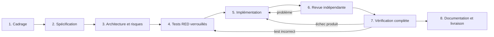
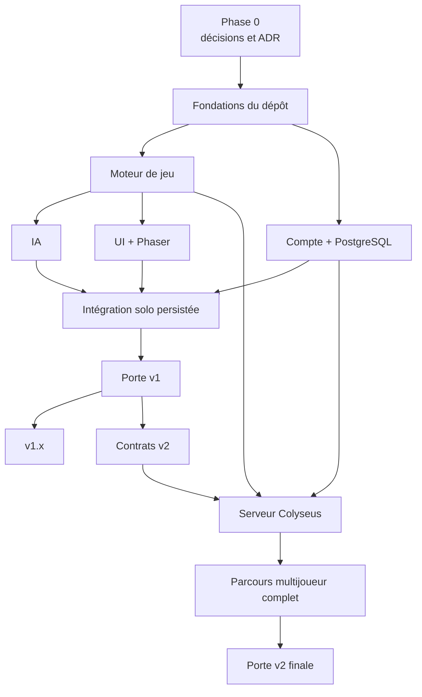

# Pipeline complète de développement jusqu'à la v2 finale

## But

Ce document décrit la séquence complète de réalisation de ThreeStone,
depuis le cadrage actuel jusqu'à une v2 multijoueur exploitable en production.
Il définit :

- le cycle obligatoire de chaque fonctionnalité ;
- les responsabilités des agents ;
- les dépendances entre lots ;
- les tests attendus ;
- les portes de validation des phases 0, v1, v1.x et v2 ;
- les conditions terminales de la v2.

Il ne constitue pas une autorisation de pousser ou déployer. Les lots v2 ont été
explicitement ouverts et exécutés localement ; toute action distante reste
soumise à une validation séparée du propriétaire.

Références :

- [`../README.md`](../README.md) — produit, règles et roadmap ;
- [`ARCHITECTURE.md`](./ARCHITECTURE.md) — frontières et flux techniques ;
- [`../AGENTS.md`](../AGENTS.md) — standards et intégrité TDD.

## État d'avancement au 30 juillet 2026

La candidate v2 est fonctionnelle et vérifiée localement. Les états ci-dessous
distinguent la preuve produit de la mise en production réelle :

| Ensemble | État | Preuves principales |
| --- | --- | --- |
| Phase 0 et ADR v1 | `VERIFIED` | règles `1.0.0`, compte/données, stack, déterminisme, identité par pseudonyme, topologie et budgets documentés |
| Fondations F1 | `VERIFIED` pour la candidate | monorepo strict, configuration validée, PostgreSQL, migrations, API durcie et CI reproductible |
| Moteur G1 | `VERIFIED` | transitions, refus, vues privées, propriétés et replay déterministe |
| Compte/API A1 | `VERIFIED` | Better Auth par pseudonyme, identité modifiable, bio privée, avatar modifiable par son propriétaire et visible comme identité de jeu authentifiée, session, mot de passe, préférences, export API et suppression sur PostgreSQL réel |
| IA I1 | `VERIFIED` | actions légales, absence de secret, graine injectée et calibration reproductible des trois niveaux |
| Interface U1 | `VERIFIED` | React accessible, tutoriel, Phaser Canvas sans audio, contraste, mouvement réduit et responsive |
| Solo/résultats S1 | `VERIFIED` | partie complète, résultat idempotent, historique/statistiques et parcours E2E multi-navigateurs |
| Livraison R1 | `READY_FOR_RELEASE` local uniquement | build et smoke tests locaux passants ; staging, restauration répétée, audit de sécurité de release et production restent à exécuter sur l'infrastructure cible |
| v2 multijoueur | `READY_FOR_VALIDATION` | serveur autoritaire, admission, reprise, délais, demande pour rejouer, historique, audit complet, accessibilité et charge 20 salons / 40 connexions |
| Livraison v2 | `AWAITING_APPROVAL` | runbook et rollback documentés ; aucun push, staging ou déploiement exécuté |

La CI démarre PostgreSQL, applique les migrations, exécute les suites
Vitest avec intégration réelle, construit les workspaces puis joue le parcours
compte → partie → statistiques → suppression sur Chromium, Firefox et WebKit.
Un état `RELEASED` ne devra être utilisé qu’après une validation explicite, un
staging puis la production.

## Signification de « v2 finale »

La v2 est terminale pour cette pipeline lorsque :

- le solo v1 reste pleinement fonctionnel ;
- le cycle de compte v1 est opérationnel ;
- deux joueurs authentifiés peuvent terminer une partie dans un salon privé ;
- le serveur arbitre toutes les règles et protège les choix cachés ;
- reconnexion, délai, abandon et double soumission sont traités ;
- le résultat est persisté une seule fois ;
- sécurité, accessibilité, observabilité, migrations et exploitation sont
  validées localement ;
- la livraison, le drainage et le retour arrière sont documentés et
  exécutables.

Les fonctionnalités hors périmètre ne sont pas nécessaires pour atteindre cet
état terminal de développement. Le staging, la production et leur rollback
réel constituent une décision de release distincte.

## Pipeline obligatoire de toute fonctionnalité



### 1. Cadrage

Entrées :

- besoin utilisateur ;
- version de roadmap ;
- comportement existant ;
- règles et décisions applicables.

Actions :

- définir le résultat observable ;
- identifier explicitement ce qui est hors périmètre ;
- lister dépendances, migrations et intégrations ;
- repérer les décisions encore ouvertes ;
- définir risques de gameplay, sécurité, confidentialité et accessibilité.

Sortie obligatoire : fiche de fonctionnalité courte avec propriétaire,
périmètre, critères d'acceptation et dépendances.

### 2. Spécification

La spécification décrit :

- parcours nominal ;
- variantes et cas limites ;
- états de chargement, erreur et récupération ;
- actions autorisées par rôle ou siège ;
- données lues, écrites et supprimées ;
- événements et effets visibles ;
- critères d'accessibilité ;
- comportement hors ligne ou en cas de déconnexion ;
- métriques utiles et données interdites.

Une fonctionnalité de jeu ajoute ou référence des exemples sous `docs/rules/`.
Une API définit ses contrats d'entrée, sortie et erreur. Une fonctionnalité v2
définit séparément messages publics et privés.

### 3. Architecture et risques

Vérifications :

- respect des dépendances de `ARCHITECTURE.md` ;
- absence de règle métier dans UI, HTTP ou réseau ;
- autorisation côté service ;
- migration expand/migrate/contract si nécessaire ;
- idempotence des écritures retentables ;
- menace de fuite de secret ;
- stratégie de rollback.

Créer un ADR si la décision est coûteuse à inverser ou modifie une frontière,
une dépendance majeure, le modèle de données, l'authentification ou le
protocole.

### 4. Tests RED verrouillés

L'auteur de tests :

1. écrit les tests au niveau le plus bas pertinent ;
2. ajoute les tests d'intégration ou E2E réellement nécessaires ;
3. exécute les tests ;
4. prouve qu'ils échouent pour la raison attendue ;
5. consigne le résultat ;
6. verrouille le diff de tests par commit ou référence équivalente.

Les tests comprennent succès, refus, sécurité et cas limites. Une migration
inclut un test depuis la version précédente. Un bug inclut un test de
régression.

### 5. Implémentation

L'agent d'implémentation :

- travaille dans un worktree ou périmètre distinct ;
- n'édite pas les tests verrouillés ;
- implémente le plus petit changement satisfaisant la spécification ;
- maintient typage strict et frontières ;
- n'ajoute ni dépendance ni refactor non demandé ;
- exécute fréquemment les tests ciblés ;
- documente toute divergence ou limitation.

Si un test semble faux, il s'arrête et renvoie la tâche à l'auteur de tests.

### 6. Revue indépendante

Le reviewer examine en priorité :

1. exactitude des règles ;
2. fuite d'information cachée ;
3. autorisation et isolation des comptes ;
4. erreurs de concurrence et d'idempotence ;
5. compatibilité de migration ou protocole ;
6. accessibilité et états d'erreur ;
7. dérive de périmètre ;
8. qualité et pertinence des tests.

Les constats sont classés par impact avec fichier, scénario de reproduction et
raison. Le reviewer ne réécrit pas silencieusement la fonctionnalité.

### 7. Vérification complète

Contrôles applicables :

- intégrité du diff de tests ;
- format et lint ;
- TypeScript ;
- tests unitaires ;
- tests génératifs ;
- tests d'intégration API/base ;
- migrations depuis zéro et depuis N-1 ;
- tests navigateur ;
- build de production ;
- audit de dépendances ;
- inspection visuelle responsive ;
- accessibilité ;
- charge ou réseau pour les lots concernés ;
- smoke test dans un environnement propre.

### 8. Documentation et livraison

- mettre à jour README, architecture, pipeline, règles et ADR concernés ;
- décrire migrations et rollback ;
- rédiger notes de livraison et risques résiduels ;
- déployer d'abord en staging ;
- exécuter les smoke tests ;
- obtenir l'acceptation produit ;
- déployer progressivement ;
- surveiller métriques et erreurs ;
- fermer la fonctionnalité seulement après vérification de production.

## Rôles agentiques

| Rôle | Peut modifier | Ne doit pas modifier | Handoff principal |
| --- | --- | --- | --- |
| Cadrage | Spécifications et documentation produit | Code et tests | Besoin, critères, décisions |
| Architecture | ADR et architecture | Tests verrouillés | Frontières, risques, migration |
| Auteur de tests | Tests, fixtures d'assertion et générateurs | Implémentation produit | Diff RED et raison de l'échec |
| Implémentation | Code produit, config et migrations autorisées | Tests verrouillés | Diff, commandes, limites |
| Reviewer | Rapport de revue | Code sauf demande explicite séparée | Constats ordonnés |
| Vérification | Rapports et preuves | Comportement pour masquer un échec | Résultats de tous les contrôles |
| Release | Config de livraison autorisée et notes | Périmètre produit | Version, rollback, suivi |

Deux agents ne modifient pas simultanément le même fichier. Les handoffs
mentionnent toujours :

- identifiant du lot ;
- version cible ;
- fichiers autorisés ;
- critères d'acceptation ;
- décisions et hypothèses ;
- base de tests verrouillée ;
- commandes exécutées ;
- résultats et risques restants.

## États d'un lot

```text
BACKLOG
  → READY_FOR_SPEC
  → SPEC_APPROVED
  → TESTS_RED_LOCKED
  → IN_IMPLEMENTATION
  → IN_REVIEW
  → VERIFIED
  → READY_FOR_RELEASE
  → RELEASED
```

États exceptionnels :

- `BLOCKED_DECISION` : décision produit ou architecture manquante ;
- `BLOCKED_EXTERNAL` : fournisseur ou environnement indisponible ;
- `TEST_BASELINE_REOPENED` : la spécification a changé ou un test a été reconnu
  incorrect ;
- `ROLLED_BACK` : livraison retirée, avec suivi obligatoire.

Un lot ne saute pas `TESTS_RED_LOCKED`, sauf documentation pure. Un lot marqué
`RELEASED` possède une preuve de production.

## Vue des dépendances



Le moteur et les comptes peuvent avancer en parallèle après les fondations. Le
client multijoueur ne commence pas avant stabilisation du protocole.

# Phase 0 — Cadrage et décisions

## P0-01 — Règles définitives

Contenu :

- consigner la règle validée d'alternance du premier pronostic à chaque manche ;
- consolider toutes les règles validées dans `docs/rules/`;
- écrire exemples et cas limites ;
- définir un numéro initial de version des règles.

Tests attendus : table de décision prête à devenir tests du moteur.

Sortie : aucune ambiguïté bloquante sur la boucle de jeu.

## P0-02 — Périmètre du compte

Décisions :

- méthode d'inscription ;
- règles d’unicité et de normalisation du pseudonyme ;
- politique explicite en cas de mot de passe oublié ;
- pseudonyme et modération ;
- données visibles ;
- suppression et éventuelle exportation ;
- conservation des résultats ;
- fusion des préférences locales.

Sortie : parcours complets, textes d'erreur et matrice de données.

## P0-03 — ADR de stack

Valider :

- React/Vite/Phaser ;
- Hono/Better Auth ;
- PostgreSQL/Drizzle ;
- stratégie de validation Zod ;
- gestionnaire pnpm ;
- topologie de déploiement v1.

Sortie : ADR-0001 à ADR-0003 acceptés.

## P0-04 — Direction visuelle et budget

- moodboard et références autorisées ;
- identité ThreeStone et logo de référence ;
- fantasy stylisée nordique/médiévale, formes massives et rendu hand-painted ;
- palette cuir, bois, parchemin, gris pierre, bronze et charbon brun ;
- prototype de table, cailloux et main ;
- budget d'images, sons et chargement ;
- appareils et navigateurs cibles ;
- seuils d'accessibilité et réduction de mouvement ;
- preuve que la 2.5D atteint l'intention sans vraie 3D.

Sortie : direction validée et liste d'assets à produire.

## P0-05 — Menaces et données

- menaces auth, API, client et futur temps réel ;
- classification des données ;
- matrice de rétention ;
- politique de logs ;
- responsabilités de sauvegarde et restauration ;
- confinement des champs techniques imposés par le fournisseur
  d’authentification.

Sortie : modèle de menace initial et ADR de rétention.

## Porte Phase 0

**État : franchie pour la v1.**

- Toutes les règles sont décidées.
- Le périmètre du compte est accepté.
- Les ADR structurants v1 sont acceptés.
- Le modèle de menace initial existe.
- La direction visuelle et les cibles sont mesurables.
- README, architecture et pipeline ne se contredisent pas.

# Fondations v1

## F1-01 — Initialisation du monorepo

- pnpm workspace ;
- `apps/web`, `apps/api` et packages v1 ;
- TypeScript strict partagé ;
- scripts cohérents ;
- verrouillage des versions ;
- règles d'import et de dépendance.

Tests : build minimal de chaque workspace et contrôle des frontières.

## F1-02 — Qualité et intégration continue

- format et lint ;
- typecheck ;
- Vitest ;
- tests de propriétés avec générateurs déterministes partagés ;
- Playwright ;
- détection de secrets ;
- audit de dépendances ;
- cache CI sans masquer les échecs ;
- artefacts de rapports.

Porte : une erreur volontaire de chaque catégorie fait échouer la CI.

## F1-03 — Configuration et secrets

- schémas d'environnement par application ;
- validation au démarrage ;
- exemples sans secret ;
- séparation local/test/staging/production ;
- rotation et propriété des secrets ;
- interdiction d'exposer une variable serveur à Vite.

## F1-04 — PostgreSQL local et tests

- instance de développement ;
- base éphémère de test ;
- pool et timeouts ;
- commandes de migration ;
- sauvegarde et restauration documentées ;
- aucune donnée de production en local.

## F1-05 — Socle API

- serveur Hono ;
- erreurs structurées ;
- identifiant de corrélation ;
- logs avec redaction ;
- liveness et readiness ;
- CORS et en-têtes de sécurité ;
- taille maximale des requêtes ;
- arrêt gracieux.

## Porte Fondations

**État : franchie pour la candidate v1.**

- Le dépôt se construit dans un environnement propre.
- La CI bloque lint, types, tests et secrets.
- L'API démarre avec configuration validée.
- Les migrations peuvent s'exécuter sur une base vierge.
- Les frontières de packages sont testées.

# Moteur de jeu v1

## G1-01 — Vocabulaire et types du domaine

- Game, Round, Player, Reserve, Prediction, Action, Event ;
- état interne, vue publique et observation privée ;
- erreurs de domaine ;
- version des règles.

Tests RED : construction valide et refus des états impossibles.

## G1-02 — Initialisation et initiative

- deux joueurs ;
- trois cailloux chacun ;
- premier joueur conforme à la règle d'alternance entre parties ;
- graine et identifiant stables.

Tests : déterminisme, réserves et initiative.

## G1-03 — Choix cachés

- choix compris entre zéro et réserve ;
- choix des deux joueurs requis ;
- aucune valeur dans la vue adverse ;
- double soumission refusée ou traitée selon contrat.

Tests : bornes, phase et non-divulgation.

## G1-04 — Pronostics

- ordre séquentiel ;
- valeurs `0..6` ;
- pronostics distincts ;
- valeur impossible dans l'état courant autorisée ;
- alternance du premier joueur à annoncer à chaque manche.

Tests : chaque borne, collision et mauvais siège.

## G1-05 — Révélation et résolution

- somme ;
- retour des cailloux cachés ;
- retrait exact d'un caillou au bon pronostic ;
- aucun changement sans bon pronostic ;
- événements publics ordonnés.

Tests : toutes les sommes, gagnant unique et manche nulle.

## G1-06 — Fin et partie suivante

- victoire à réserve zéro ;
- état terminal ;
- aucune action après fin ;
- préparation de la manche suivante ;
- alternance entre parties.

## G1-07 — Tests génératifs et replay

- séquences arbitraires d'actions ;
- invariants toujours vrais ;
- reproduction par graine et historique ;
- comparaison de deux exécutions ;
- absence de dépendance à l'heure ou au framerate.

## Porte Moteur

**État : franchie — lots G1 `VERIFIED`.**

- Toutes les règles ont des tests.
- Toutes les transitions illégales sont refusées.
- Aucun secret n'apparaît dans une vue interdite.
- Les tests génératifs passent avec un volume défini.
- Le moteur ne dépend d'aucun framework.

# Compte, API et base de données v1

## A1-01 — Schéma et migrations d'authentification

- schéma Better Auth ;
- adaptateur Drizzle ;
- migrations générées et revues ;
- contrainte d'identité ;
- index nécessaires ;
- tests zéro et N-1.

## A1-02 — Inscription par pseudonyme

- formulaire accessible ;
- validation client ergonomique et validation serveur autoritaire ;
- création de compte et session immédiate ;
- pseudonyme unique sans distinction de casse ;
- aucune collecte ni vérification d’email ;
- absence de route publique de disponibilité ;
- limitation de débit ;
- consentements nécessaires.

## A1-03 — Connexion, session et déconnexion

- cookie sécurisé ;
- session au chargement ;
- expiration ;
- déconnexion de la session courante ;
- invalidation correcte ;
- redirection sans boucle.

## A1-04 — Changement de mot de passe

- session et mot de passe actuel requis ;
- bornes du nouveau secret ;
- ancien secret refusé après succès ;
- nouveau secret accepté ;
- révocation des autres sessions ;
- absence assumée de récupération d’un mot de passe oublié en v1.

## A1-05 — Identité et profil joueur

- création atomique ou paresseuse du profil ;
- pseudonyme d’identité validé et unique ;
- changement authentifié du pseudonyme avec conservation de la session ;
- lecture de son propre profil ;
- page Profil avec bannière, bio, statistiques et dernières parties ;
- page Confidentialité en panneaux repliables ;
- bio normalisée et bornée à 280 caractères ;
- avatar JPEG, PNG ou WebP borné à 1 Mio, signature validée et accès privé ;
- ajout et suppression de l’avatar versionnés avec le profil ;
- concurrence de deux modifications ;
- politique de modération si requise.

## A1-06 — Préférences

- audio ;
- réduction des mouvements ;
- affichage ;
- tutoriel ;
- fusion locale/serveur ;
- validation des valeurs ;
- mise à jour partielle sans perte.

## A1-07 — Suppression du compte

- réauthentification par mot de passe ;
- révocation des sessions ;
- suppression ou anonymisation applicative ;
- comportement avec résultats ;
- confirmation utilisateur ;
- idempotence ;
- preuve de test de disparition des données.

## A1-08 — Sécurité API

- autorisation objet par objet ;
- CSRF, CORS et origines ;
- en-têtes ;
- limites de taille et débit ;
- redaction ;
- injection et XSS ;
- tests d'accès croisé entre deux comptes.

## Porte Compte

**État : franchie — lots A1 `VERIFIED` sur PostgreSQL réel.**

- Tous les parcours fonctionnent dans Playwright.
- Le profil et les réglages de confidentialité restent utilisables sur mobile.
- Aucun compte ne peut lire ou modifier un autre.
- Les cookies et réponses respectent la politique de sécurité.
- Les routes d’authentification ne divulguent aucune adresse technique interne.
- La suppression respecte la matrice de données.
- Les migrations sont répétables et restaurables.

# IA v1

## I1-01 — Port de décision

- observation privée uniquement ;
- liste d'actions légales ;
- graine injectée ;
- profil de difficulté ;
- aucun type React ou Phaser.

## I1-02 — Stratégie de choix caché

- distribution de base ;
- adaptation à la réserve ;
- hasard reproductible ;
- action toujours légale.

## I1-03 — Stratégie de pronostic

- distribution des sommes ;
- exclusion du pronostic déjà annoncé ;
- bluff contrôlé ;
- respect de `0..6`.

## I1-04 — Mémoire et difficultés

- historique public limité ;
- paramètres explicites par niveau ;
- erreur contrôlée ;
- aucune triche.

## I1-05 — Simulation et calibrage

- IA contre politiques de référence ;
- grand nombre de parties reproductibles ;
- taux de victoire, durée et diversité ;
- seuils acceptés par difficulté ;
- rapport conservé comme artefact.

## Porte IA

**État : franchie — lots I1 `VERIFIED` par tests et simulations
reproductibles.**

- Zéro action illégale sur les simulations.
- Zéro accès à un choix caché adverse.
- Résultats reproductibles.
- Difficulté mesurée et non seulement déclarée.

# Interface et rendu v1

## U1-01 — Shell, navigation et session

- chargement initial ;
- accueil minimal sur le visuel des deux mains ;
- actions « Commencez une partie » et « Comment jouer » ;
- lanceur mode → difficulté → chargement → partie solo ;
- multijoueur clairement signalé comme fonctionnalité v2 non active ;
- paramètres audio, mouvement et contraste séparés de l’accueil ;
- vues publiques et compte ;
- états de session ;
- gestion d'erreur globale ;
- responsive de base.

## U1-02 — Règles et aide

- accès direct depuis l’accueil ;
- rappel accessible dans le DOM ;
- possibilité de consulter et revenir à l’accueil ;
- aucune répétition du contenu sur la page d’accueil.

## U1-03 — Contrôles de partie

- choix secret `0..réserve` ;
- choix par cailloux tactiles sélectionnables ; aucune sélection vaut zéro ;
- pronostic par curseur `0..6`, sans grille de chiffres ;
- valeur du premier pronostic interdite au second joueur ;
- initiative visible et pronostics affichés près de chaque profil ;
- prévention de double clic ;
- clavier, tactile et souris ;
- annonces pour lecteur d'écran.

## U1-04 — Contrôleur React/Phaser

- traduction action → moteur ;
- traduction événement → animation ;
- séquence testée `premier pronostic → deux pronostics → révélation → résolution` ;
- mise à jour des réserves au moment du caillou jeté ;
- passage et accélération ;
- aucune mutation métier par Phaser ;
- destruction et remontage sans fuite.

## U1-05 — Plateau 2.5D fantasy nordique stylisée

- fond neutre en pierre chaude, mains fantasy stylisées et réserves près des
  profils ;
- palette bruns, beige cassé, gris pierre, bronze et charbon chaud ;
- formes massives et anguleuses inspirées d’un rendu hand-painted ;
- mains fermées pendant les choix et les deux pronostics ;
- ouverture animée, cailloux facettés dynamiques, somme révélée et lancer en arc
  du caillou retiré ;
- portrait, paysage et bureau ;
- alternative textuelle ;
- renderer Canvas déterministe, sans dépendance à WebGL.

## U1-06 — Audio et mouvement

- effets courts sur la sélection des cailloux et les validations ;
- musique d'ambiance à réintroduire seulement avec un morceau et une licence
  validés ;
- volume ;
- muet ;
- réduction des mouvements ;
- persistance locale et compte ;
- aucun blocage si audio refusé par le navigateur.

## U1-07 — Assets et performance

- provenance et licence ;
- compression ;
- chargement progressif ;
- budgets ;
- mesure sur appareils cibles ;
- absence de saut bloquant.

## Porte Interface

**État : franchie — lots U1 `VERIFIED` sur les cibles navigateur de la v1.**

- Partie manipulable sans souris.
- Aucune information essentielle seulement dans le canvas.
- Toutes les animations peuvent être réduites ou passées.
- Les tailles d'écran cibles sont validées visuellement.
- Les budgets convenus sont respectés.

# Intégration solo et résultats v1

## S1-01 — Partie solo complète

- démarrage depuis le profil ;
- choix humain ;
- décision IA ;
- pronostics selon initiative ;
- révélation ;
- manches successives ;
- victoire et bouton « Rejouer ».

## S1-02 — Enregistrement idempotent

- identifiant de partie ;
- DTO validé ;
- résultat terminal seulement ;
- écriture transactionnelle ;
- retry sans doublon ;
- contradiction refusée ;
- indication claire que le résultat solo n'est pas autoritaire.

## S1-03 — Historique et statistiques

- liste paginée ;
- Journal de jeu fusionné par date entre solo et multijoueur ;
- nombre total de parties et Stones multijoueur ;
- état vide ;
- cohérence avec la source `game_record` ;
- aucune ambition compétitive.

## S1-04 — Erreurs et réseau

- session expirée après une partie ;
- API indisponible ;
- timeout ;
- retry idempotent ;
- erreur de persistance sans perte silencieuse ;
- message actionnable.

## S1-05 — Parcours E2E

- nouveau compte jusqu'à première victoire ;
- reconnexion puis consultation des statistiques ;
- préférences sur deux sessions ;
- suppression du compte ;
- parcours clavier ;
- mobile ;
- réduction des mouvements.

## Porte v1 candidate

**État : franchie.** Tous les lots produit v1 précédents sont `VERIFIED`.

# Livraison v1

## R1-01 — Revue de sécurité

- menace mise à jour ;
- session, autorisation, CSRF, CORS, XSS ;
- brute force ;
- secrets ;
- dépendances ;
- données et suppression ;
- résultats solo explicitement non fiables.

## R1-02 — Répétition des migrations

- sauvegarde staging ;
- migration N-1 vers candidate ;
- smoke tests ;
- restauration ;
- durée et verrouillage observés ;
- procédure approuvée.

## R1-03 — Validation non fonctionnelle

- navigateurs et appareils cibles ;
- accessibilité ;
- poids et temps de chargement ;
- charge API d'inscription/connexion/résultats ;
- saturation PostgreSQL ;
- comportement sous tentatives répétées d’authentification.

## R1-04 — Staging et acceptation

- déploiement reproductible ;
- données fictives ;
- smoke tests automatisés ;
- parcours produit manuel ;
- absence d'erreur bloquante ;
- approbation explicite.

## R1-05 — Production

- sauvegarde ;
- migrations compatibles ;
- déploiement progressif ;
- smoke tests ;
- suivi métriques et logs ;
- décision go/no-go ;
- rollback si seuil dépassé ;
- rétrospective courte.

## Porte v1 finale

**État : `READY_FOR_RELEASE`, non `RELEASED`.** Les critères fonctionnels et les
commandes locales sont satisfaits. La preuve de restauration staging, le
déploiement progressif et la surveillance de production dépendent de
l'infrastructure cible et restent des opérations R1.

- Moteur, IA, compte, profil, préférences, solo et statistiques satisfont leurs
  critères.
- Toutes les commandes qualité passent depuis un checkout propre.
- Migrations et restauration ont été prouvées.
- Sécurité et accessibilité n'ont aucun défaut bloquant.
- Production est surveillée et le rollback est exécutable.
- Documentation et notes de livraison sont à jour.

# Version 1.x — Améliorations mesurées

## X1-01 — Calibration IA

- analyser uniquement des données autorisées ;
- comparer aux simulations ;
- modifier un paramètre à la fois ;
- verrouiller des scénarios de non-régression ;
- vérifier que la difficulté ne devient pas de la triche.

## X1-02 — Finition visuelle

- prioriser à partir de tests utilisateurs et mesures ;
- améliorer assets sans dépasser les budgets ;
- vérifier contraste, mouvement et lisibilité ;
- comparer avant/après sur appareils cibles.

## X1-03 — Chargement et stabilité

- profiler ;
- optimiser le chemin critique ;
- traiter fuites Phaser et erreurs client ;
- éviter cache ou complexité sans mesure.

## X1-04 — Mode local éventuel

Ce lot ne s'ouvre qu'après décision produit :

- protocole de choix secret sur appareil partagé ;
- risque d'observation de l'écran ;
- ergonomie de passage de l'appareil ;
- tests utilisateurs ;
- aucune régression solo.

La v2 n'est pas bloquée par ce lot facultatif.

# Fondations multijoueur v2

> Cette section conserve le cadrage historique de la roadmap. L'exécution de la
> v2 est désormais définie par [`SPEC_V2.md`](./SPEC_V2.md) et
> [`PIPELINE_V2.md`](./PIPELINE_V2.md), qui prévalent en cas de divergence.

## M2-01 — ADR protocole et compatibilité

- version du protocole ;
- commandes et messages ;
- vues publiques et privées ;
- stratégie de compatibilité client/serveur ;
- erreurs ;
- limites de taille et débit.

## M2-02 — Package de protocole

- unions discriminées ;
- schémas d'exécution ;
- snapshots ;
- messages privés ;
- identifiants de commande ;
- tests de compatibilité et données malformées.

## M2-03 — Ticket d'identité

- session web vers ticket court ;
- signature et JWKS ou mécanisme validé ;
- audience, expiration, salle et nonce ;
- conservation mémoire seulement ;
- rejeu refusé ;
- rotation de clé ;
- horloges désynchronisées dans la tolérance décidée.

## M2-04 — Socle Colyseus

- démarrage et configuration ;
- liveness/readiness ;
- logs redacted ;
- arrêt gracieux ;
- room de test ;
- limites de connexions et messages ;
- aucun secret dans l'état synchronisé par défaut.

## M2-05 — Salle privée et sièges

- création ;
- code d'invitation opaque ;
- deux sièges ;
- authentification ;
- refus d'un troisième joueur ;
- expiration d'une salle vide ;
- collision et brute force sur les codes.

## Porte Fondations v2

- Le protocole est versionné et testé.
- Un ticket expiré, réutilisé ou destiné à une autre salle est refusé.
- Les secrets ne sont pas dans le schéma public.
- Une salle accepte exactement deux identités autorisées.
- Le serveur s'arrête proprement sans accepter de nouvelle partie.

# Gameplay multijoueur v2

## O2-01 — Démarrage synchronisé

- les deux sièges prêts ;
- version de règles compatible ;
- initiative ;
- snapshot initial filtré ;
- numéro de séquence.

## O2-02 — Choix cachés

- commande validée ;
- stockage serveur privé ;
- accusé sans valeur adverse ;
- double soumission ;
- deux onglets ;
- test d'inspection de tous les messages envoyés à l'adversaire.

## O2-03 — Pronostics

- ordre serveur ;
- valeurs `0..6` ;
- différence imposée ;
- action hors tour refusée ;
- message public après acceptation.

## O2-04 — Révélation et résolution

- moteur partagé ;
- événement atomique ;
- mêmes vues pour les deux clients après révélation ;
- animations locales indépendantes ;
- manche suivante ;
- victoire.

## O2-05 — Resynchronisation

- perte de message simulée ;
- snapshot filtré ;
- numéro de séquence ;
- commande obsolète ;
- reprise sans rejouer une transition.

## O2-06 — Reconnexion

- fenêtre de reconnexion ;
- nouvelle authentification ;
- remplacement contrôlé de connexion ;
- reprise du siège ;
- snapshot privé correct ;
- expiration.

## O2-07 — Délais et abandon

- horloge serveur ;
- avertissement ;
- expiration transformée en action de domaine ;
- abandon explicite ;
- déconnexion prolongée ;
- résultat terminal non ambigu.

## O2-08 — Persistance terminale

- victoire normale ;
- abandon ;
- délai ;
- annulation sans résultat si applicable ;
- transaction participants/statistiques ;
- retry ;
- identifiant unique ;
- aucun double incrément.

## O2-09 — Historique multijoueur

- résultat autoritaire marqué séparément ;
- deux participants voient le même résultat ;
- pagination ;
- pseudonyme selon politique de confidentialité ;
- suppression de compte selon matrice de données.

## Porte Gameplay v2

- Deux clients terminent toutes les variantes de partie.
- Aucun choix caché n'est observable avant révélation.
- Les actions hors tour ou du mauvais siège sont refusées.
- Reconnexion et resynchronisation convergent vers l'état serveur.
- Chaque partie terminale produit au plus un résultat.

# Durcissement et exploitation v2

## D2-01 — Sécurité réseau

- fuzz des messages ;
- taille maximale ;
- débit par connexion et identité ;
- brute force des invitations ;
- tickets ;
- isolation des salles ;
- logs ;
- dépendances ;
- test d'accès croisé.

## D2-02 — Concurrence

- double clic ;
- messages réordonnés ;
- messages dupliqués ;
- deux onglets ;
- reconnexion pendant résolution ;
- persistance concurrente ;
- déploiement pendant salle active.

## D2-03 — Charge

Scénarios :

- connexions simultanées ;
- création de salles ;
- salles actives ;
- messages de tour ;
- reconnexions ;
- finalisations PostgreSQL.

Mesures :

- CPU et mémoire ;
- latence de boucle ;
- event loop lag ;
- réseau ;
- pool DB ;
- erreurs.

Redis ou multi-instance ne sont autorisés qu'après interprétation de ces
résultats et ADR.

## D2-04 — Résilience

- API indisponible lors du ticket ;
- PostgreSQL indisponible à la fin ;
- retry idempotent ;
- redémarrage serveur ;
- fournisseur externe dégradé ;
- arrêt gracieux ;
- seuils d'alerte.

## D2-05 — Observabilité

- tableaux de bord ;
- alertes actionnables ;
- identifiants de corrélation API/salle/résultat ;
- redaction contrôlée ;
- runbooks : salle bloquée, échec de persistance, hausse de reconnexions,
  saturation.

## D2-06 — Accessibilité multijoueur

- salle et invitation au clavier ;
- annonce attente/adversaire/délai ;
- focus après reconnexion ;
- erreurs sans dépendre de la couleur ;
- rythme compatible avec lecteur d'écran ;
- réduction des mouvements.

## D2-07 — Compatibilité de déploiement

- client N avec serveur N ;
- stratégie pour ancien client ;
- refus explicite d'une version incompatible ;
- migration DB compatible ;
- politique des salles actives ;
- rollback serveur et client.

# Livraison v2 finale

## V2-R1 — Candidate staging

- topologie de production ;
- deux comptes de test ;
- parcours complet normal ;
- reconnexion ;
- abandon ;
- délai ;
- échec DB simulé ;
- migration et restauration ;
- tests de sécurité.

## V2-R2 — Bêta contrôlée

- groupe limité ;
- consentement et support ;
- métriques techniques ;
- aucun classement public ;
- suivi des erreurs et reconnexions ;
- critères d'arrêt prédéfinis.

## V2-R3 — Revue finale

Revues indépendantes :

- gameplay ;
- sécurité ;
- données ;
- accessibilité ;
- performance ;
- exploitation ;
- intégrité des tests ;
- documentation.

Tout défaut critique ou élevé non accepté bloque la sortie.

## V2-R4 — Production

1. Geler les changements non essentiels.
2. Sauvegarder et vérifier la restauration.
3. Appliquer les migrations compatibles.
4. Déployer API et serveur compatibles.
5. Déployer le client.
6. Exécuter les smoke tests solo et multijoueur.
7. Ouvrir progressivement les nouvelles salles.
8. Surveiller erreurs, reconnexions, latence et persistance.
9. Continuer ou revenir en arrière selon les seuils.
10. Vérifier les salles actives après stabilisation.

## Porte v2 terminale

### Produit

- Salon privé créé et rejoint par code.
- Deux joueurs authentifiés terminent une partie.
- Règles identiques au solo.
- Reconnexion, abandon et délai compris par les joueurs.
- Historique cohérent pour les deux comptes.

### Intégrité et sécurité

- Serveur seul autoritaire.
- Zéro secret adverse avant révélation dans les captures réseau et logs.
- Tickets courts et non rejouables.
- Autorisation par siège et par salle.
- Résultat idempotent.
- Aucune vulnérabilité bloquante ouverte.

### Qualité

- Tests verrouillés intacts.
- Lint, format, types, unitaires, génératifs, intégration, E2E et build verts.
- Tests de charge dans les seuils.
- Navigateurs et appareils cibles validés.
- Accessibilité sans défaut bloquant.

### Données et exploitation

- Migrations prouvées depuis zéro et depuis la v1.
- Rétention et suppression conformes.
- Logs redacted.
- Métriques bornées, seuils et runbooks disponibles.
- Drainage et rollback testés au niveau applicatif ; répétition cloud après
  autorisation d’un staging.
- Équipe capable de diagnostiquer une salle et un résultat sans lire de secret.

### Documentation

- README, architecture, pipeline et AGENTS cohérents.
- ADR acceptés.
- Protocole versionné.
- Notes de livraison et limites connues publiées.
- Aucun comportement important documenté uniquement dans le code.

Lorsque tous les points locaux sont prouvés, la candidate atteint la fin de la
pipeline de développement. Elle ne devient `RELEASED` qu’après les opérations
distantes explicitement approuvées. Toute fonctionnalité supplémentaire ouvre
une nouvelle roadmap.

# Matrice minimale de tests

| Domaine | Unitaires | Génératifs | Intégration | E2E | Sécurité/charge |
| --- | --- | --- | --- | --- | --- |
| Règles | Obligatoire | Obligatoire | Adaptateurs | Solo complet | Non-divulgation |
| IA | Obligatoire | Simulations | Avec moteur | Partie solo | Anti-triche |
| Auth | Services/helpers | Selon besoin | Better Auth + DB | Cycle complet | Brute force, CSRF, authz |
| Profil/préférences | Obligatoire | Valeurs bornées | Repositories | Deux comptes | Isolation |
| Résultats | Obligatoire | Idempotence | Transactions | Historique | Concurrence |
| React/Phaser | Présentateurs | Séquences | Contrôleur | Responsive/a11y | Budget assets |
| Protocole v2 | Schémas | Messages arbitraires | Serveur/client | Deux navigateurs | Fuzz/débit |
| Reconnexion | Machine d'état | Ordres réseau | Salle réelle | Coupures | Charge |
| Migrations | Mappers | Sans objet | Zéro + N-1 | Smoke | Restauration |

# Pipeline CI cible

## Pull request

1. Validation des fichiers et absence de secret.
2. Installation verrouillée.
3. Format et lint.
4. TypeScript.
5. Tests unitaires et génératifs.
6. Contrôle d'intégrité des tests verrouillés.
7. PostgreSQL éphémère et migrations.
8. Tests API et repositories.
9. Build de chaque application.
10. Playwright ciblé.
11. Rapport de dépendances.
12. Charge multijoueur 20 salons / 40 connexions.

## Branche principale

- tous les contrôles de pull request ;
- suite Playwright complète ;
- tests multi-navigateurs planifiés ;
- image ou artefact reproductible ;
- déploiement staging ;
- smoke tests automatiques ;
- rapport de migration.

## Release

- artefact déjà vérifié, jamais reconstruit différemment ;
- approbation ;
- sauvegarde ;
- récupération contrôlée des variables Vercel de production ;
- migration Neon explicite avec l'URL non poolée ;
- déploiement du projet Vercel racine ;
- smoke tests ;
- observation ;
- décision de clôture ou rollback vers le déploiement Vercel précédent.

Pour la v1 Vercel, les preuves minimales sont :

- `pnpm check` ;
- `vercel build --prod` sans erreur TypeScript ni route manquante ;
- migrations appliquées avec `scripts/migrate-vercel-production.sh` ;
- réponses valides de `/`, `/api/health/live` et `/api/health/ready` ;
- création, connexion et suppression d'un compte de smoke test ;
- vérification qu'aucune variable sensible n'est suivie par Git.

# Gestion d'un bug

1. Capturer le comportement et l'impact.
2. Réduire à un scénario reproductible.
3. Identifier la frontière responsable.
4. Écrire un test de régression RED.
5. Verrouiller le test.
6. Corriger sans modifier le test.
7. Exécuter tests ciblés puis suite complète.
8. Revoir sécurité, données et compatibilité.
9. Documenter si le comportement public change.
10. Livrer selon la criticité et vérifier en production.

Un incident de secret, authentification ou résultat dupliqué suit aussi le
processus d'incident : limitation immédiate, préservation des preuves avec
redaction, analyse, correction, communication appropriée et action systémique.

# Modèle de fiche de fonctionnalité

Chaque lot peut utiliser la structure suivante :

```text
Identifiant :
Version cible :
Responsable :
Statut :

Objectif observable :
Hors périmètre :
Prérequis :
Décisions/ADR :

Parcours nominal :
Cas limites :
Erreurs et récupération :
Sécurité/confidentialité :
Accessibilité :
Données et rétention :

Critères d'acceptation :
Tests RED :
Tests verrouillés à :

Migrations :
Rollback :
Documentation :

Commandes exécutées :
Résultats :
Risques restants :
```

# Règles de clôture

Une tâche n'est pas close parce que le code compile. Elle est close lorsque :

- le comportement accepté est observable ;
- les tests rouges sont devenus verts sans être affaiblis ;
- les contrôles applicables passent ;
- les données et secrets sont protégés ;
- le déploiement et le rollback sont compris ;
- la documentation correspond au comportement réel ;
- les preuves sont incluses dans le handoff.

Une phase n'est pas close tant que sa porte n'est pas entièrement satisfaite ou
qu'une exception n'a pas été explicitement acceptée avec propriétaire, échéance
et risque.
