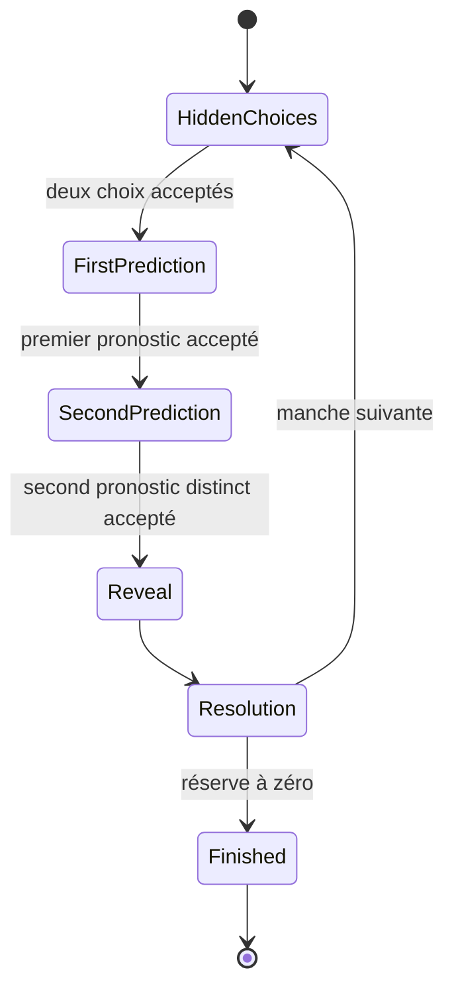

# Spécification des règles de jeu v1

- Statut : acceptée
- Date : 2026-07-29
- Version des règles : `1.0.0`
- Modes concernés : solo v1, puis moteur partagé v2

## 1. Portée normative

Ce document fixe la boucle de jeu, les actions légales, les erreurs attendues,
les informations visibles et les cas limites. Le rendu, la durée des
animations, l'authentification, l'équilibrage de l'IA et le multijoueur sont
hors de cette spécification.

Les mots « doit », « refuse » et « émet » sont normatifs. Un refus métier
retourne une erreur explicite et conserve exactement l'état précédent.

## 2. Vocabulaire

| Terme                        | Définition                                                   |
| ---------------------------- | ------------------------------------------------------------ |
| Partie (`Game`)              | Séquence de manches jusqu'à ce qu'une réserve atteigne zéro  |
| Manche (`Round`)             | Deux choix cachés, deux pronostics, révélation et résolution |
| Siège (`Player`)             | `playerOne` ou `playerTwo`, stables pendant la partie        |
| Réserve (`Reserve`)          | Cailloux restant à éliminer, de 0 à 3                        |
| Choix caché (`HiddenChoice`) | Nombre temporairement présenté dans la main                  |
| Pronostic (`Prediction`)     | Entier annoncé comme somme des deux mains                    |
| Premier annonçant            | Siège autorisé à pronostiquer en premier dans la manche      |
| État interne                 | État complet connu du moteur                                 |
| Vue publique                 | Projection ne contenant aucun secret non révélé              |
| Observation privée           | Vue publique enrichie du propre secret d'un siège            |
| Action                       | Intention validée par le moteur                              |
| Événement                    | Fait confirmé, ordonné et dérivé d'une transition acceptée   |

L'identité humaine ou IA appartient à un adaptateur. Les règles raisonnent
uniquement en sièges.

## 3. Constantes de la version `1.0.0`

- nombre de joueurs : exactement 2 ;
- réserve initiale : exactement 3 par siège ;
- choix caché minimal : 0 ;
- choix caché maximal : réserve courante de son siège ;
- pronostic minimal : 0 ;
- pronostic maximal : 6 ;
- retrait après pronostic exact : exactement 1 caillou ;
- limite de manches : aucune ;
- égalité finale : impossible avec les règles valides.

Ces constantes ne sont pas configurables dans une partie `1.0.0`.

## 4. Création et succession des parties

La création reçoit :

- un `gameId` UUID v4 canonique en minuscules, opaque pour le métier ;
- la version exacte `1.0.0` ;
- une graine entière non signée de 32 bits, de 0 à `4 294 967 295` ;
- le siège premier annonçant de la première manche.

Elle produit une partie à la manche 1, avec deux réserves à 3, aucun choix,
aucun pronostic et aucun gagnant. L'état stable est `hiddenChoices`.

Dans la v1 solo, le premier jeu d'une chaîne de revanche commence avec
`playerOne`, le siège humain. Une revanche après une partie terminée commence
avec l'autre siège par rapport à la première manche de la partie précédente.
Le moteur expose cette alternance sans lire la base ou l'heure. Une nouvelle
chaîne ouverte depuis le menu, sans partie précédente, recommence avec
`playerOne`.

Une partie existante ne peut pas être « recréée » avec le même identifiant dans
le moteur. L'idempotence de persistance d'un résultat relève de l'API.

Événements initiaux, dans cet ordre :

1. `GameCreated`, sans secret ;
2. `RoundStarted`, avec numéro 1 et premier annonçant.

## 5. Machine à états

`Reveal` et `Resolution` sont des étapes atomiques internes produites par
l'acceptation du second pronostic. Elles émettent des événements distincts,
mais n'attendent jamais une animation ni une nouvelle action UI. L'état stable
retourné est soit `hiddenChoices` pour la manche suivante, soit `finished`.

Une action reçue dans toute autre phase que celle autorisée est refusée sans
mutation.

## 6. Choix cachés

### 6.1 Action

`SubmitHiddenChoice` contient le siège et une valeur.

L'action est acceptée si et seulement si :

1. la partie n'est pas terminée ;
2. la phase est `hiddenChoices` ;
3. le siège appartient à la partie ;
4. ce siège n'a pas déjà soumis de choix dans cette manche ;
5. la valeur est un entier ;
6. `0 ≤ valeur ≤ réserve du siège`.

Les sièges peuvent soumettre dans n'importe quel ordre. Le premier choix
n'accorde aucun droit de pronostiquer avant le second choix.

Une seconde soumission est toujours refusée par `CHOICE_ALREADY_SUBMITTED`,
même si la valeur est identique. L'idempotence de commandes réseau v2 sera une
couche distincte fondée sur un identifiant de commande.

### 6.2 Effet et confidentialité

Le choix est enregistré dans l'état interne sans diminuer la réserve. Avant la
révélation :

- la vue publique indique seulement que le siège est prêt ;
- l'observation du siège contient son propre choix ;
- l'observation adverse ne contient ni valeur, ni borne plus précise que la
  réserve publique ;
- l'événement public `HiddenChoiceAccepted` contient le siège mais pas la
  valeur.

Après le second choix, la phase devient `firstPrediction`.

## 7. Pronostics

### 7.1 Premier pronostic

Seul le premier annonçant de la manche peut agir en phase
`firstPrediction`. Sa valeur est acceptée si elle est un entier entre 0 et 6,
bounds incluses.

Le pronostic peut être impossible compte tenu des réserves ou du propre choix.
Par exemple, annoncer 6 avec des réserves de 1 et 1 reste légal.

Après acceptation :

- `PredictionAnnounced` est public avec siège, valeur et ordre `first` ;
- la phase devient `secondPrediction` ;
- l'autre siège devient le seul annonçant autorisé.

### 7.2 Second pronostic

Le second annonçant suit les mêmes bornes, mais sa valeur doit être différente
du premier pronostic. Une égalité est refusée par
`PREDICTION_ALREADY_TAKEN`, sans révéler les mains et sans changer de phase.

Après un second pronostic valide, le moteur émet `PredictionAnnounced` avec
l'ordre `second`, puis révèle et résout immédiatement la manche.

Un siège ne peut annoncer qu'une fois par manche. Soumettre pour l'autre siège,
avant les deux choix, hors tour, ou après la fin est toujours refusé.

## 8. Révélation et résolution

La somme révélée est l'addition exacte des deux choix cachés. Les deux valeurs
et la somme deviennent publiques simultanément dans `HandsRevealed`.

Les cailloux cachés ne quittent jamais la réserve. La réserve change uniquement
si un pronostic est exact :

- si le premier pronostic égale la somme, son auteur gagne la manche ;
- sinon, si le second pronostic égale la somme, son auteur gagne la manche ;
- sinon, la manche est sans gagnant ;
- les deux pronostics étant distincts, les deux joueurs ne peuvent pas gagner
  la même manche.

Le gagnant retire exactement un caillou de sa réserve. Une réserve à 1 devient
0 ; aucune réserve ne devient négative. Une manche sans gagnant ne modifie
aucune réserve et n'applique aucune pénalité.

Événements de la transition, dans l'ordre :

1. `PredictionAnnounced` pour le second pronostic ;
2. `HandsRevealed` avec les deux choix et la somme ;
3. `RoundResolved` avec gagnant éventuel, somme et pronostics ;
4. `ReserveDecreased` si un joueur a gagné, avec ancienne et nouvelle valeurs ;
5. soit `GameWon`, soit les événements de manche suivante décrits ci-dessous.

`RoundResolved` sans gagnant contient explicitement `winner: null`. Aucun
événement ne dépend de l'animation de révélation.

## 9. Manche suivante et initiative

Si les deux réserves restent strictement positives :

1. le numéro de manche augmente de 1 ;
2. le premier annonçant devient l'autre siège ;
3. choix et pronostics de la manche précédente sont effacés de l'état courant ;
4. la phase stable redevient `hiddenChoices`.

Le moteur émet, après la résolution :

1. `InitiativeTransferred`, avec ancien et nouveau siège ;
2. `RoundStarted`, avec le nouveau numéro et le nouveau premier annonçant.

L'alternance s'applique après une manche gagnée comme après une manche sans
gagnant. Elle ne dépend pas du gagnant de la manche.

## 10. Fin de partie

Si une réserve atteint zéro après `ReserveDecreased` :

- son propriétaire est l'unique gagnant ;
- la phase devient `finished` ;
- `GameWon` contient le siège, le numéro de manche et les réserves finales ;
- aucune manche suivante et aucun transfert d'initiative ne sont émis ;
- tout choix ou pronostic ultérieur est refusé par `GAME_FINISHED`.

La v1 n'a ni abandon, ni délai, ni égalité, ni sauvegarde d'une partie en cours.
Un rechargement avant la fin abandonne localement la partie sans résultat
persisté.

## 11. Vues et observations

### 11.1 Vue publique avant révélation

Elle contient au minimum :

- `gameId`, version, phase et numéro de manche ;
- sièges et réserves ;
- premier et prochain annonçant ;
- indicateur de choix reçu pour chaque siège ;
- pronostics déjà annoncés ;
- gagnant seulement si terminé.

Elle ne contient jamais :

- choix caché, y compris sous une clé optionnelle définie à `undefined` ;
- graine ou état du générateur pseudo-aléatoire ;
- actions internes ou historique secret.

### 11.2 Observation privée

Elle ajoute uniquement :

- le propre choix accepté, s'il existe ;
- la liste des actions actuellement légales pour ce siège.

Elle ne contient jamais le choix adverse avant `HandsRevealed`. L'IA reçoit ce
type exact et aucun mécanisme d'accès à l'état interne.

Après révélation, les choix de la manche sont publics dans l'événement. Ils ne
restent pas dans l'état de la manche suivante.

## 12. Erreurs de domaine

Les codes stables minimaux sont :

| Code                        | Cause                                               |
| --------------------------- | --------------------------------------------------- |
| `INVALID_GAME_ID`           | Identifiant différent d'un UUID v4 canonique        |
| `INVALID_SEED`              | Graine non entière ou hors plage 32 bits non signée |
| `INVALID_STARTING_PLAYER`   | Premier annonçant différent des deux sièges         |
| `UNSUPPORTED_RULES_VERSION` | Version différente de `1.0.0`                       |
| `UNKNOWN_PLAYER`            | Siège absent de la partie                           |
| `INVALID_PHASE`             | Action incompatible avec la phase                   |
| `GAME_FINISHED`             | Action après état terminal                          |
| `INVALID_HIDDEN_CHOICE`     | Valeur non entière ou hors `0..réserve`             |
| `CHOICE_ALREADY_SUBMITTED`  | Second choix du même siège dans la manche           |
| `NOT_PREDICTOR_TURN`        | Mauvais siège pour le pronostic courant             |
| `INVALID_PREDICTION`        | Valeur non entière ou hors `0..6`                   |
| `PREDICTION_ALREADY_TAKEN`  | Second pronostic identique au premier               |

Une erreur contient le code et un contexte public minimal. Elle n'inclut jamais
le choix adverse, l'état interne sérialisé ou une trace destinée au joueur.

## 13. Table de décision principale

| Phase              | Action                           | Conditions                | Résultat                 |
| ------------------ | -------------------------------- | ------------------------- | ------------------------ |
| `hiddenChoices`    | choix du siège non prêt          | entier dans sa réserve    | choix accepté            |
| `hiddenChoices`    | second choix du même siège       | toute valeur              | refus sans mutation      |
| `hiddenChoices`    | pronostic                        | même du premier annonçant | refus de phase           |
| `firstPrediction`  | choix                            | toute valeur              | refus de phase           |
| `firstPrediction`  | pronostic premier siège          | entier `0..6`             | phase second pronostic   |
| `firstPrediction`  | pronostic autre siège            | entier `0..6`             | refus de tour            |
| `secondPrediction` | pronostic second siège différent | entier `0..6`             | révélation et résolution |
| `secondPrediction` | pronostic égal au premier        | entier `0..6`             | refus, phase inchangée   |
| `secondPrediction` | pronostic premier siège          | toute valeur              | refus de tour            |
| `finished`         | choix ou pronostic               | toute valeur              | `GAME_FINISHED`          |

## 14. Cas limites normatifs

1. Deux choix à 0 produisent une somme 0 ; un pronostic 0 gagne.
2. Deux choix à 3 produisent une somme 6 lorsque les réserves valent 3.
3. Un joueur avec une réserve de 1 peut choisir 0 ou 1, jamais 2.
4. Un pronostic 0 ou 6 est légal quelle que soit la somme actuellement
   possible.
5. `1.5`, `NaN`, `Infinity`, une chaîne `"1"` et `null` ne sont pas des
   entiers valides à la frontière d'exécution.
6. Si le premier pronostic vaut 6, le second peut choisir toute valeur de 0 à 5.
7. Si aucun pronostic n'est exact pendant un nombre arbitraire de manches, la
   partie continue et les réserves restent valides.
8. Si le gagnant d'une manche avait une réserve de 1, la partie se termine avant
   toute création de manche suivante.
9. La valeur choisie peut être égale à toute la réserve sans que cette réserve
   diminue à la révélation.
10. Une action refusée ne change ni phase, ni numéro, ni événements, ni état du
    générateur pseudo-aléatoire.
11. À état initial et actions identiques, deux exécutions produisent des
    structures profondément égales.
12. Détruire ou accélérer la scène Phaser ne modifie aucun résultat.

## 15. Exemples

### Victoire du second annonçant

- réserves : 3 et 2 ;
- choix : `playerOne=2`, `playerTwo=1` ;
- premier annonçant : `playerOne`, pronostic 2 ;
- second pronostic : `playerTwo=3` ;
- somme : 3 ;
- nouvelle réserve de `playerTwo` : 1 ;
- prochain premier annonçant : `playerTwo`.

### Manche sans gagnant

- choix : 0 et 1, somme 1 ;
- pronostics : 3 puis 6 ;
- aucune réserve ne change ;
- le numéro augmente et l'initiative alterne.

### Fin de partie

- réserves : `playerOne=1`, `playerTwo=2` ;
- `playerOne` pronostique exactement la somme ;
- sa réserve devient 0 ;
- `GameWon(playerOne)` est terminal et aucune manche suivante n'existe.

## 16. Matrice de tests RED

Les tests précèdent l'implémentation et couvrent :

- construction valide, version, identifiant et réserves initiales ;
- chaque transition valide et chaque famille d'erreur ;
- toutes les valeurs de choix aux bornes pour chaque réserve 1, 2 et 3 ;
- pronostics 0 à 6, collision et valeurs d'exécution invalides ;
- toutes les combinaisons de choix possibles et chaque gagnant éventuel ;
- retrait exact, manche nulle, victoire et terminalité ;
- alternance sur au moins quatre manches et trois parties successives ;
- événement et ordre exact de chaque transition ;
- absence structurelle de secret dans chaque projection et événement public ;
- propriété `0 ≤ réserve ≤ 3` sur des séquences générées ;
- propriété « au maximum un gagnant de manche » ;
- propriété « refus = état profondément inchangé » ;
- déterminisme à graine et historique identiques ;
- indépendance de l'heure, de l'animation et du framerate.

Un test de règle `1.0.0` ne doit pas être modifié pour adapter une
implémentation. Toute nouvelle règle observable exige une version et une
spécification explicites.
