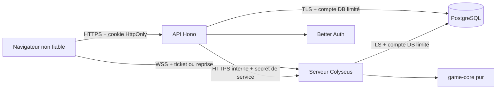

# Modèle de menaces — ThreeStone v2

## Portée

Ce modèle couvre la candidate locale v2 : application React/Vite, API Hono,
Better Auth, PostgreSQL/Drizzle, serveur Colyseus, protocole WebSocket, salons
privés et historique multijoueur. Il complète `SPEC_V2.md` et
`ARCHITECTURE.md`.

Sont hors périmètre : sécurité physique des postes, compromission du fournisseur
d’hébergement, matchmaking public, chat libre, classement, multi-instance,
Redis et futurs moyens de paiement.

## Actifs à protéger

| Actif | Propriété attendue |
| --- | --- |
| Mot de passe et cookie Better Auth | confidentialité, intégrité, révocation |
| Ticket d’admission et jeton de reprise | confidentialité, durée courte ou usage unique, liaison au salon et au siège |
| Choix caché | absent de tout message adverse avant révélation |
| État autoritaire et séquence | intégrité, ordre et idempotence |
| Code d’invitation | non énumérable, non journalisé, erreur publique générique |
| Profil, avatar et historique | accès limité au compte ou aux deux participants |
| Résultat et transcript | intégrité, écriture terminale idempotente |
| Bail actif | unicité par compte, propriétaire vérifié, expiration après crash |
| Secrets de service | absents du client, du dépôt, des URL et des logs |

## Acteurs

- joueur authentifié honnête ;
- joueur authentifié malveillant contrôlant son navigateur et ses messages ;
- visiteur non authentifié ;
- site tiers tentant CSRF, CORS ou ouverture WebSocket croisée ;
- attaquant réseau, supposé bloqué par HTTPS/WSS en production ;
- opérateur disposant des secrets d’environnement ;
- dépendance ou chaîne de build compromise.

Un client, même authentifié, n’est jamais une autorité de jeu.

## Frontières de confiance

Les frontières critiques sont :

1. entrées HTTP et cookies vers l’API ;
2. trames, tickets et commandes vers Colyseus ;
3. projections publiques/privées du serveur vers chaque siège ;
4. canal interne API → serveur de jeu ;
5. repositories → PostgreSQL ;
6. variables serveur → build Vite.

## Surfaces et scénarios

### Authentification et compte

Menaces : credential stuffing, énumération de pseudonymes, fixation ou vol de
session, CSRF sur une mutation, avatar surdimensionné ou au type trompeur,
lecture/modification d’un autre profil.

Contrôles :

- Better Auth, cookie `httpOnly`, `secure` en production et origines de
  confiance ;
- limitation de débit réseau et compte sur les routes sensibles ;
- rejet des origines tierces sur les mutations ;
- identité prise dans la session, jamais dans un identifiant client ;
- limites de corps, validation stricte et validation binaire de l’avatar ;
- erreurs publiques bornées et identifiant de corrélation.

Risque résiduel : l’absence volontaire de récupération du mot de passe peut
entraîner une perte de compte, mais n’affaiblit pas l’autorisation.

### Admission et code de salon

Menaces : brute force du code, énumération par différence d’erreur, réutilisation
d’un ticket, échange de siège, ticket dans l’URL ou le referer, contournement du
bail « un compte, un salon ».

Contrôles :

- code à forte cardinalité, hashé avant stockage et erreur
  `ROOM_UNAVAILABLE` générique ;
- débit limité par compte et réseau ;
- ticket HMAC de 45 secondes, identifiant à usage unique, salon, siège,
  utilisateur et génération signés ;
- ticket conservé en mémoire et transmis dans les options de connexion ;
- canal interne protégé par un secret comparé en temps constant ;
- bail PostgreSQL de 120 secondes renouvelé toutes les 30 secondes.

Risque résiduel : un invité peut transmettre volontairement son code à un tiers
avant que le second siège soit occupé.

### Commandes et état autoritaire

Menaces : message malformé ou trop gros, cadence abusive, commande réordonnée,
double envoi, réutilisation contradictoire d’un `commandId`, action pour un
autre salon, manipulation d’horloge ou de résultat.

Contrôles :

- trames WebSocket limitées à 2 Kio et commandes à 1 Kio ;
- schémas Zod stricts, valeurs et identifiants bornés ;
- maximum de 30 messages par seconde et réactions plus strictement limitées ;
- `roomId`, `knownSequence`, phase, siège et échéance vérifiés côté serveur ;
- déduplication par compte et empreinte de commande ;
- moteur `game-core` pur ; le serveur seul applique les transitions.

Risque résiduel : une saturation distribuée de l’instance unique relève de la
protection réseau de l’hébergeur ; la v2 ne promet pas une défense DDoS
applicative multi-instance.

### Confidentialité du bluff

Menaces : choix adverse dans un snapshot, propriété présente à `undefined`,
borne dérivée, indicateur de soumission, taille de message corrélée, log ou
métrique révélant le choix, accès croisé entre salons.

Contrôles :

- état interne séparé du snapshot public et de l’observation privée ;
- choix adverse structurellement absent jusqu’à la révélation ;
- aucun indicateur public de soumission, conformément à l’option B ;
- accusé de commande de forme constante ;
- tests inspectant `hasOwnProperty`, messages adverses et charge inter-salon ;
- métriques numériques sans identifiant, ticket, code ni valeur de jeu.

Risque résiduel : la latence réseau globale peut indiquer qu’une phase change,
mais pas quel choix a été soumis ni qui attendait avant la réception des deux
choix.

### Reconnexion et déconnexion

Menaces : déconnexion volontaire pour gagner du temps, rejeu du jeton de
reprise, ancien onglet encore actif, dépendance à l’API pendant une coupure.

Contrôles :

- le délai du siège qui doit agir continue pendant sa déconnexion ;
- grâce de 60 secondes seulement lorsqu’aucune action n’est due, budget cumulé
  de 120 secondes ;
- jeton de reprise de 43 à 256 caractères, hashé, rotatif et à usage unique ;
- génération croissante, fermeture de l’ancienne connexion et snapshot filtré ;
- reprise directe auprès de Colyseus sans appel API.

Risque résiduel : un crash du processus perd l’état mémoire ; la partie est
annulée et le bail orphelin expire, sans inventer de gagnant.

### Persistance et historique

Menaces : double résultat, transcript contradictoire, écriture partielle,
lecture par un tiers, résultat perdu lors d’une panne transitoire, identité
orpheline après suppression.

Contrôles :

- transaction partie/participants/manches et contraintes SQL ;
- `gameId` idempotent, contradiction refusée ;
- repository d’historique filtré par l’utilisateur de session ;
- suppression de compte avec `user_id` nullable et libellé anonymisé ;
- file de reprise mémoire à backoff borné et ultime tentative avant fermeture ;
- aucune partie annulée techniquement persistée comme victoire.

Risque résiduel : un crash simultané du game-server et de PostgreSQL peut perdre
un résultat non encore écrit. La v2 initiale n’emploie pas de journal durable de
commandes ; l’incident reste visible par les métriques d’échec.

### Navigateur et chaîne de livraison

Menaces : XSS, framing, fuite de secret dans le bundle, dépendance compromise,
origine WebSocket tierce, configuration HTTP non chiffrée en production.

Contrôles :

- rendu React sans HTML arbitraire, CSP, HSTS, `nosniff`, referrer strict et
  `frame-ancestors 'none'` ;
- origine WebSocket exacte et WSS/HTTPS obligatoires en production ;
- seuls les noms `VITE_*` explicitement publics entrent dans le client ;
- lockfile, audit de secrets CI et tests de build ;
- secrets distincts par environnement et rotation par redéploiement contrôlé.

Risque résiduel : `style-src 'unsafe-inline'` reste nécessaire aux styles
dynamiques actuels. Il n’autorise pas l’exécution de script et doit être
réévalué si la présentation change.

## Invariants de sécurité vérifiables

- Une commande non validée ne modifie aucun état.
- Le client ne choisit jamais le gagnant ni la réserve officielle.
- Le choix caché adverse est absent, pas masqué.
- Un ticket ou jeton consommé ne fonctionne pas une seconde fois.
- Une identité ne lit pas l’historique d’une partie à laquelle elle ne
  participe pas.
- Une annulation technique ne produit ni gagnant ni résultat.
- Un drainage refuse immédiatement les nouvelles admissions et annule les
  salons restant après dix minutes.
- Les métriques ne contiennent aucune donnée permettant de rejouer ou rejoindre
  un salon.

## Hypothèses d’exploitation

- TLS se termine sur une infrastructure de confiance et WSS est conservé
  jusqu’au serveur de jeu.
- Les secrets sont aléatoires, distincts et injectés hors dépôt.
- Les comptes PostgreSQL de l’API, du serveur de jeu et des migrations suivent
  le moindre privilège dans l’environnement cible.
- L’instance Colyseus est un processus Node longue durée, jamais une fonction
  serverless.
- Les sauvegardes et journaux de l’hébergeur suivent une rétention définie avant
  production.

## Revue

Ce modèle est revu lors d’un changement d’authentification, de protocole, de
topologie, de rétention, de multi-instance ou d’ajout de contenu utilisateur
libre.

Repository: https://github.com/Danii15321/ThreeStone.git
Version: feat/v2-multiplayer-local-candidate
